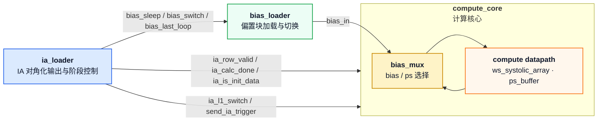
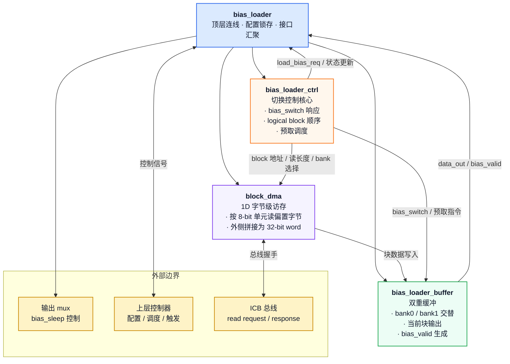

# `bias_loader` 新版设计文档

<!-- markdownlint-disable MD060 -->

> **版本**：v2.0  
> **更新日期**：2026-04-19  
> **目标**：描述基于 1D `block_dma` 和双重缓冲的新版 `bias_loader`，用于适配 `ia_loader` 输出模式变化后的偏置加载与切换流程。  
> **图示约定**：本文所有 Mermaid 图均显式指定颜色，避免在不同主题下出现歧义。

---

## 1. 版本变更记录

| 版本 | 主要变化 |
|---|---|
| v1.0 | 旧版自主访存 bias_loader；基于 `partial_sum_calc_over` / `tile_calc_over` 驱动，单路径偏置输出 |
| v2.0 | 新版 bias_loader；使用 1D `block_dma` 读取偏置；引入 `bias_switch` 单拍切换；内部双缓冲交替工作；分组顺序改为由 `ia_reuse_num` / `w_reuse_num` 间接驱动 |

---

## 2. 模块概述

新版 `bias_loader` 负责向脉动阵列提供偏置向量，并根据计算流的消费顺序进行块级输出与切换。与旧版设计相比，新版有三项核心变化：

1. **访存方式改为 1D burst 块读**：继续复用 `block_dma`，每个 bias block 只发起一次 burst 事务，按 8-bit 单元连续读取整块偏置字节，再在 buffer 侧外部拼接为 32-bit bias word。
2. **双重缓冲**：内部维护两个 bias block buffer，当前输出块与下一块交替切换，实现预取与输出并行。
3. **切换由 `bias_switch` 驱动**：`bias_switch` 由 `ia_loader` 输出，表示当前偏置块已被消费完成，模块据此切换到下一个块，并立即准备读取后继块。

新版 `bias_loader` 不再依赖 `partial_sum_calc_over` / `tile_calc_over` 进行阶段管理，这两个信号在新版接口中已移除。

### 2.1 与 `ia_loader` / `compute_core` 的连接关系



该连接关系对应当前实现中的三条边界：`ia_loader` 负责 IA 侧对角化输出和阶段控制，`bias_loader` 负责偏置块供给，而 `compute_core` 内部的 `bias_mux` 负责在偏置与部分和之间切换。

---

## 3. 设计目标

- 使用与 `kernel_loader` 一致的分层风格，便于综合、验证和后续扩展。
- 通过 1D `block_dma` 读取偏置向量块，减少偏置加载和权重加载之间的实现差异。
- 使用双缓冲隐藏访存延迟，做到“当前块输出时，下一块已经在读”。
- 使用 `bias_switch` 作为唯一的块级消费边沿，避免旧版中围绕部分和/Tile 边沿的复杂状态机。
- 让分组顺序由 `ia_reuse_num` / `w_reuse_num` 间接决定，而不是由 bias_loader 内部直接解析计算链路。
- `bias_sleep` 也由 `ia_loader` 输出，作为外部 mux 的屏蔽信号；对于 init_data 阶段，从 `start` 到 `cache_l1_done` 期间保持低电平。

---

## 4. 模块分层与架构

### 4.1 顶层结构

新版 `bias_loader` 建议拆分为以下三层：

- `bias_loader` 顶层：配置锁存、端口汇聚、外部接口连接。
- `bias_loader_ctrl`：块顺序控制、双缓冲切换、预取请求发起、`bias_switch` 响应。
- `bias_loader_buffer`：两个 buffer bank 的数据存储、当前输出 bank 选择和 `bias_valid` 生成。
- `block_dma`：沿用现有块级访存引擎，但以一维向量的方式读取偏置块。

### 4.2 模块层级图



---

## 5. 接口定义

### 5.1 控制与配置端口

| 信号 | 方向 | 位宽 | 说明 |
|---|---|---|---|
| `clk` | In | 1 | 系统时钟 |
| `rst_n` | In | 1 | 异步低有效复位 |
| `init_cfg` | In | 1 | 单拍脉冲，锁存偏置配置并启动新一轮调度 |
| `bias_base` | In | `REG_WIDTH` | 偏置向量基地址 |
| `k` | In | `REG_WIDTH` | 预留/兼容字段，可用于上层调度或地址派生 |
| `m` | In | `REG_WIDTH` | 偏置向量长度方向的总元素数，决定逻辑块数 |
| `ia_reuse_num` | In | `REG_WIDTH` | IA 侧复用轮次，决定偏置块是否需要回卷 |
| `w_reuse_num` | In | `REG_WIDTH` | W 侧复用窗口宽度，参与间接分组控制 |
| `bias_switch` | In | 1 | 单拍脉冲，表示当前偏置块已被消费完成，请切换到下一个块 |
| `bias_sleep` | In | 1 | 由 `ia_loader` 输出的屏蔽电平；`start` 到 `cache_l1_done` 期间对 init_data 保持低电平，之后可拉高 |
| `load_bias_req` | Out | 1 | 请求上层授权，准备读取下一 bias block |
| `load_bias_granted` | In | 1 | 上层授权，允许 `block_dma` 开始当前块读取 |
| `bias_valid` | Out | 1 | 当前输出 bank 的偏置块已经准备好，可供使用 |

### 5.2 输出端口

| 信号 | 方向 | 位宽 | 说明 |
|---|---|---|---|
| `data_out[SIZE]` | Out | signed `[DATA_WIDTH-1:0]` | 当前 bias block 的并行输出向量 |

### 5.3 ICB 接口

新版 `bias_loader` 继续使用 ICB Master 方式访问外部存储，但读取模型改成一维块读：

| 接口 | 方向 | 说明 |
|---|---|---|
| `icb_cmd_m` / `icb_cmd_s` | Out / In | 命令通道，发起读请求并接收 ready |
| `icb_rsp_s` / `icb_rsp_m` | In / Out | 响应通道，接收读数据并完成握手 |

---

## 6. 1D `block_dma` 读取模型

### 6.1 读模型说明

新版偏置数据按一维向量切块，每个块的长度等于脉动阵列宽度 `SIZE`。`block_dma` 仍然用于块级访存，但每个偏置块只发起一次 burst 读；读取粒度仍为 8-bit 字节，buffer 侧再把连续四个字节拼成一个 32-bit bias word：

- `rows_to_read` 固定为 1，表示一个 block 对应一个 burst 命令。
- `burst_len_m1` 等于 `block_elems - 1`，控制 burst 连续读出整个块。
- 每个 beat 提供 4 个字节，buffer 侧按字节位置将其拼接回 32-bit word。
- 地址按 block 序号线性递增，块间步长为 `SIZE × 4` 字节。

### 6.2 块划分方式

假设 bias 向量被按脉动阵列尺寸划分为 4 个块：

```text
block0  block1  block2  block3
1       2       3       4
```

逻辑上，`bias_loader` 处理的是一个循环块序列，而不是单次完整向量读出。

### 6.3 边界处理

- 最后一个块若有效元素不足 `SIZE`，`block_dma` 只读取有效字节数。
- 多余位置在 buffer 内保持约定填充值，保证输出宽度一致。
- 这里的补零仅用于尾块越界保护，不再承担“取消偏置输出”的语义；是否屏蔽偏置由外部 `bias_sleep` 控制。

---

## 7. 双重缓冲与切换策略

### 7.1 双缓冲结构

内部维护两个 buffer bank：

- `bank0`：当前输出 bank，连接到 `data_out`。
- `bank1`：下一块预取 bank，供 `block_dma` 异步填充。

两者轮流作为 active / prefetch 目标，形成 ping-pong 行为。

### 7.2 缓冲工作流程

1. 先读取块0到 `bank0`，同时预取块1到 `bank1`。
2. `bank0` 读取完成后立即拉高 `bias_valid`，`data_out` 直接输出该块。
3. 收到 `bias_switch` 后，当前输出指针切换到另一个 bank。
4. 切换时，刚刚释放的 bank 立刻作为新一轮预取目标，开始读取后继块。
5. 边界切换时，逻辑块序号按模运算回卷到 block0，因此 block3 后面是 block0。

### 7.3 `bias_valid` 语义

`bias_valid` 只表示“当前 active bank 的偏置块已经就绪”。

- 若当前块读取完成，则 `bias_valid=1`。
- 若 `bias_switch` 已到但新 bank 仍在加载，或者切换请求先于目标 bank 装载完成被接受，则 `bias_valid` 暂时保持 0，直到新 bank 完成。
- `bias_valid` 不再与 `partial_sum_calc_over` 或 `tile_calc_over` 绑定。

### 7.4 `init_data` 阶段的外部约定

对于初始偏置数据（`init_data`）阶段，`bias_sleep` 与 `bias_switch` 的推荐约定如下：

- 对于每个 init group，从 `start` 到该组 `cache_l1_done` 完成为止，`bias_sleep` 保持低电平，表示该组初始偏置必须参与输出。
- `cache_l1_done` 拉高后，表示当前 `init_data` 已输出完成；若后续需要进入下一 bias block，可以在该边界同拍发出 `bias_switch` 脉冲。
- `bias_switch` 只负责切换到下一个 bias block，不负责屏蔽输出；输出屏蔽始终由 `bias_sleep` 通过外部 mux 完成。
- `bias_last_loop` 由 `ia_loader` 输出，表示当前处于最后一个 L2 group；当该信号有效时，bias_loader 在最后一个 bias block 输出完成后不得回卷到 block0。

---

## 8. `bias_switch` 时序语义

### 8.1 基本定义

`bias_switch` 是单拍脉冲，表示当前 bias block 已经使用完成，可以切到下一个块。

### 8.2 切换行为

当 `bias_switch` 到来时，模块执行以下动作：

1. 输出指针切换到另一个 buffer bank。
2. 当前 bank 立即作为预取目标，开始读取下一个逻辑 bias block。
3. 若新 active bank 尚未加载完成，或者该 bank 的读请求因 backpressure 仍停留在 pending 状态，则 `bias_valid` 暂时不置高。
4. 若新 active bank 已经有效，则 `bias_valid` 立即拉高。

`bias_switch` 的典型触发点是 W 分块切换边界。对于 `init_data` 阶段，通常在当前 init group 的 `cache_l1_done` 同拍发出 `bias_switch` 脉冲切换到下一块。

### 8.3 示例

假设逻辑块序列为 `block0, block1, block2, block3`：

| 时序 | 输出 bank | 预取 bank | 说明 |
|---|---|---|---|
| 初始 | block0 | block1 | block0 先就绪并开始输出 |
| `bias_switch` #1 | block1 | block2 | 切到 block1，同时预取 block2 |
| `bias_switch` #2 | block2 | block3 | 切到 block2，同时预取 block3 |
| `bias_switch` #3 | block3 | block0 | 到边界后回卷到起始块 |

---

## 9. 与 `ia_reuse_num` / `w_reuse_num` 的间接关系

新版 `bias_loader` 的分组顺序不再由 `partial_sum_calc_over` / `tile_calc_over` 直接驱动，而是由上层控制器根据 `ia_reuse_num` 和 `w_reuse_num` 计算后的计算流间接驱动。

### 9.1 角色分工

- `bias_loader_ctrl`：只负责执行块切换、预取和回卷，不直接解析 IA 侧的计算细节。
- 上层控制器 / `ia_loader`：根据 `ia_reuse_num` / `w_reuse_num` 和当前计算模式，决定何时发出 `bias_switch`，以及当前 bias block 的逻辑顺序；`bias_sleep` 也由 `ia_loader` 按阶段电平驱动。
- `bias_loader_buffer`：只关心 active bank 是否 ready，不关心复用策略来源。

### 9.2 设计含义

这意味着：

- `ia_reuse_num` / `w_reuse_num` 仍然参与 bias 块的分组与回卷。
- 但这种参与是通过上层调度间接完成的，而不是 bias_loader 内部直接按这两个参数自行推导 IA tile 边沿。
- 这样可以避免 bias_loader 与 `ia_loader` 的内部事件强耦合，方便适配 `ia_loader` 输出模式变化。

---

## 10. `bias_sleep` 外部屏蔽信号

`bias_sleep` 是由 `ia_loader` 输出的电平信号，表示当前不需要偏置输出。

- `bias_sleep` 不作为 bias_loader 内部取消偏置输出的控制条件。
- `bias_loader` 持续输出当前 active bank 的数据和 `bias_valid`。
- 外部 mux 根据 `bias_sleep` 决定是否将偏置送往后级。

对于 `init_data` 阶段，建议把 `bias_sleep` 作为“持续有效”的外部控制：在当前 init group 期间一直保持低电平，待该组完成后同拍配合 `bias_switch` 做下一块切换。

这比在模块内部反复清零输出更清晰，也更容易与不同的计算模式解耦。

---

## 11. 与旧版接口的差异

### 11.1 已删除的旧信号

新版不再使用以下信号作为主控制入口：

- `partial_sum_calc_over`
- `tile_calc_over`
- `tile_calc_start`

### 11.2 新增或强化的信号

- `bias_switch`：当前块使用完成后的切换脉冲。
- 双 buffer 的 bank 切换状态。
- `bias_valid` 仅表示当前输出 bank 就绪，而不是某个 OA Tile 状态。

### 11.3 语义变化

- 旧版强调“某个 OA Tile 的第一次部分和是否输出偏置”。
- 新版强调“当前 bias block 是否 ready，ready 后持续输出，直到 `bias_switch` 切换到下一个 block”。
- 旧版需要在模块内部判断是否置零；新版改为由外部 `bias_sleep` mux 处理。

---

## 12. 典型工作时序

以 4 个逻辑块为例：

```text
Cycle 0 : init_cfg，锁存配置
Cycle 1 : block0 / block1 开始预取
Cycle 2 : block0 完成，bias_valid=1，输出 block0
Cycle 3 : bias_switch=1，切到 block1，同时预取 block2
Cycle 4 : block1 完成后 bias_valid=1，输出 block1
Cycle 5 : bias_switch=1，切到 block2，同时预取 block3
Cycle 6 : bias_switch=1，切到 block3
Cycle 7 : bias_switch=1，切回 block0
```

实际实现中，`bias_valid` 是否在切换拍立即拉高，取决于目标 bank 是否已经加载完成。

---

## 13. 设计约束

1. `bias_switch` 必须是单拍脉冲，避免重复切换。
2. 双缓冲必须保证“当前输出 bank”与“预取 bank”互斥。
3. `bias_valid` 只表达当前 bank 可用，不表达是否需要输出给后级。
4. `bias_sleep` 的输出屏蔽必须在模块外部完成。
5. 逻辑块回卷采用环形序列，边界处 `blockN-1` 之后回到 `block0`。
6. 旧版 `partial_sum_calc_over` / `tile_calc_over` 的语义不得再作为新设计依据。

---

## 14. 结论

新版 `bias_loader` 通过 1D `block_dma`、双重缓冲、`bias_switch` 驱动的块级切换，以及由 `ia_reuse_num` / `w_reuse_num` 间接影响的调度顺序，使偏置输出与新的 `ia_loader` 输出模式保持一致。

设计上，`bias_loader` 只关注“当前块是否 ready”和“何时切换到下一块”，而“偏置是否实际送往后级”由外部 `bias_sleep` mux 负责。这样可以降低内部状态复杂度，也更适合后续验证与扩展。
