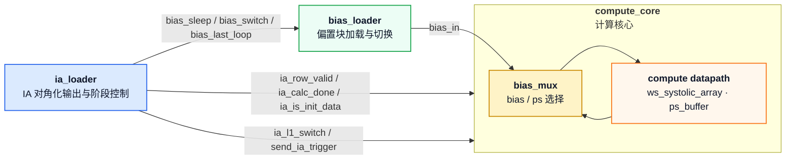
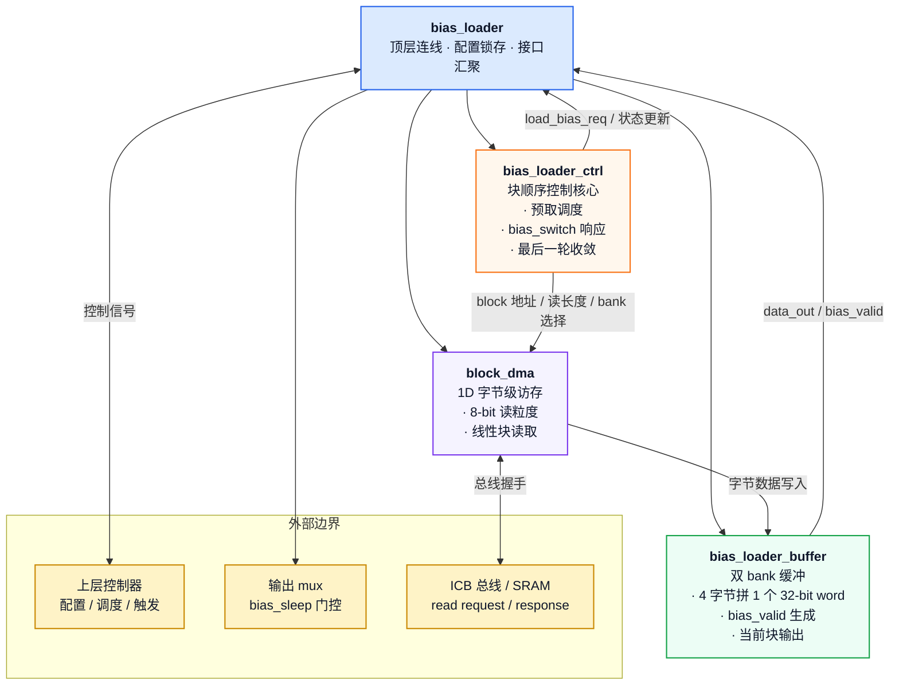

# `bias_loader` 模块 PPT 精华总结

<!-- markdownlint-disable MD060 -->

> 适用于汇报、评审和设计宣讲。内容按“模块定位 -> 功能定义 -> 设计思路 -> 架构图 -> 验证结果”组织，可直接拆分成幻灯片页面。
>
> 本文所有 Mermaid 图均显式指定颜色。

---

## 1. 一句话定位

`bias_loader` 是一个面向偏置向量的自主加载器：它通过 1D `block_dma` 以 8-bit 字节粒度对整块 bias 做一次 burst 连续读取，在 `bias_loader_buffer` 中拼接为 32-bit bias word，使用双 bank 预取与 `bias_switch` 完成块级轮转，并由 `bias_sleep` 作为外部输出屏蔽门控。

---

## 2. PPT 页面建议文案

### 页面 1：模块概述

- `bias_loader` 负责偏置向量的自主加载、缓存和块级输出。
- 新版采用“顶层 + ctrl + buffer + block_dma”的分层设计。
- DMA 仍保持 8-bit 读粒度，但每个 block 只发起一次 burst，buffer 侧把 4 个字节重组为 1 个 32-bit bias word。
- `bias_valid` 表示当前 active bank 的偏置块已准备好，可供后级使用。

### 页面 1.5：系统连接关系

- `ia_loader` 负责 IA 侧对角化输出和阶段控制。
- `bias_loader` 负责偏置块加载、预取和切换。
- `compute_core` 内部的 `bias_mux` 负责在偏置与部分和之间切换。

### 页面 2：功能定义

- `init_cfg` 锁存配置并启动新一轮偏置加载。
- `bias_base`、`m` 决定偏置块地址和块数。
- `bias_switch` 表示当前块已消费完成，需要切换到下一块。
- `bias_sleep` 作为外部 mux 门控信号，只负责屏蔽输出，不参与内部装载判定。
- `bias_last_loop` 表示当前已处于最后一个循环，最后一块输出完成后不再回卷。

### 页面 3：设计思路

- 继续复用现有 `block_dma`，避免重新实现 ICB 访存引擎。
- 每个 block 只发起一次 burst，把整块连续搬完后再切换到下一块。
- 只在 buffer 侧做 32-bit 组装，把“传输宽度”和“逻辑数据宽度”解耦。
- `bias_loader_ctrl` 只管理块顺序、预取和切换，不直接感知上层计算细节。
- `bias_switch` 采用 pending latch，避免单拍脉冲在状态切换前丢失。

### 页面 4：验证思路

- 使用 Verilator + `icb_unalign_bridge` + `tb_sram_model` 搭建完整链路。
- `tb_scoreboard` 按 32-bit bias word 做 golden 对比，尾块不足部分补零。
- `tb_test_seq` 通过 `wait_block_match()` 确认新块真实可见后再发切换脉冲。
- 覆盖单块、双块切换、尾块、回卷、最后一轮、授权反压以及 backpressure 下 valid 拉低等典型场景。
- 另外通过 `make run_random` 批量生成随机 case，随机 case 命名为 `rand_<seed>_<idx>`，用于覆盖更多 `M` 和 `last_loop` 组合。
- 随机回归以 `seed` 和 `COUNT` 控制样本规模，配合 `out_rand/case_list.txt` 逐例执行，便于持续回归和边界发现。

### 页面 5：验证结果

- `make run_all` 已通过 7/7 个预定义 case。
- 典型 case 包括 `single`、`exact_two`、`tail`、`wrap`、`long_last`、`grant_bp`、`switch_bp`。
- 新增 `switch_bp` 专门验证：当新的 bias block 因 backpressure 尚未装载完成时，`bias_valid` 会先拉低，再在加载完成后恢复。
- 已验证 32-bit bias word 的内部拼接逻辑、`bias_switch` 切换逻辑和 `bias_sleep` 门控逻辑。
- `make run_random` 也已通过，可在不同随机种子下批量生成并回归 `rand_<seed>_<idx>` case，进一步覆盖尾块、回卷和反压边界。

---

## 3. 模块层级图

---

## 4. 核心机制

### 4.1 32-bit bias word + 8-bit DMA

- 外部存储中的 bias 仍按字节组织，由 `block_dma` 以 8-bit 单元连续 burst 读取整个 block。
- `bias_loader_buffer` 负责把 4 个连续字节拼成 1 个 32-bit bias word。
- `bias_loader_ctrl` 仅发起单个 burst 命令，`rows_to_read` 固定为 1，`burst_len_m1` 按块内元素数设置。
- 这样可以保留 DMA 的通用性，同时让上层始终看到统一的 32-bit 偏置格式。

### 4.2 双 bank 轮转

- `bank0` 和 `bank1` 交替工作，当前块输出和下一块预取并行进行。
- `load_bias_req` 负责向上层申请授权，`load_bias_granted` 后启动下一次 DMA。
- `bias_switch` 到来时，当前 active bank 切换到另一侧，同时继续预取后继块。
- `bias_last_loop` 为最后一轮收尾提供边界条件，避免最后一块输出后再次回卷。

### 4.3 `bias_sleep` 门控

- `bias_sleep` 是输出屏蔽信号，不参与 DMA 装载状态判断。
- 当 `bias_sleep=1` 时，后级通过 mux 忽略 bias_loader 当前输出。
- 这样可以把“数据就绪”和“数据是否参与计算”拆成两个独立控制维度。

---

## 5. 验证与 Case 设计

### 5.1 Case 设计思路

- 先覆盖基础启动和单块输出，再验证连续双块切换。
- 再加入尾块不足 `SIZE`、多块回卷和最后一轮收敛。
- 最后加入授权反压，验证 `load_bias_req / load_bias_granted` 的握手鲁棒性。

### 5.2 覆盖总结

| Case 类别 | 代表案例 | 覆盖点 |
|---|---|---|
| 基础单块 | `single` | 启动、装载、输出、结束 |
| 连续双块 | `exact_two` | `bias_switch` 切换路径 |
| 尾块补零 | `tail` | 最后一块不足 `SIZE` 时的填充 |
| 回卷切换 | `wrap` | 非最后一轮的 block 回卷 |
| 最后一轮 | `long_last` | `bias_last_loop` 收敛路径 |
| 授权反压 | `grant_bp` | `load_bias_req / granted` 延迟握手 |
| 切换反压 | `switch_bp` | 新块未就绪时 `bias_valid` 先拉低、就绪后恢复 |

**结论**：`run_all` 已通过 7/7 个预定义 case，验证了 32-bit bias word 拼接、块级切换和输出门控逻辑。

---

## 6. 可直接上 PPT 的结论页

- `bias_loader` 采用“8-bit DMA + 32-bit buffer 组装”的实现方式，兼顾复用性与数据宽度一致性。
- `bias_loader_ctrl`、`bias_loader_buffer` 和 `block_dma` 职责清晰，便于调试和后续扩展。
- `bias_switch` 与 `bias_last_loop` 使块级切换和末轮收敛语义明确。
- `make run_all` 已通过 7/7，验证链路稳定。
- `make run_random` 已建立批量随机回归入口，可持续补充 `M` 和 `last_loop` 的边界覆盖。
