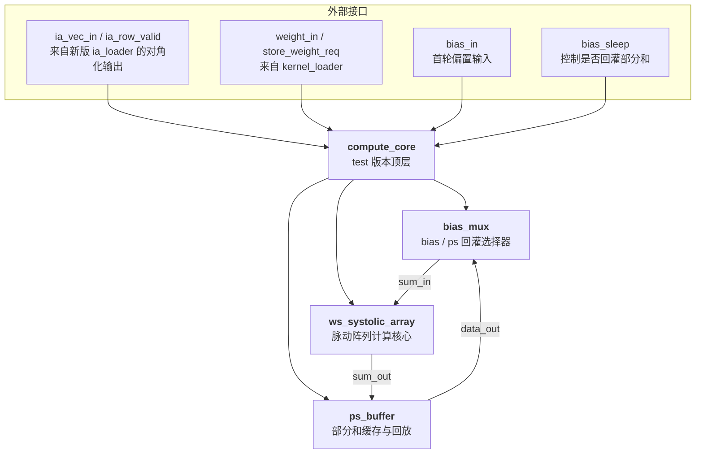

# `compute_core` 设计文档（test 版本）

> **版本**：v1.0  
> **更新日期**：2026-04-18  
> **目标**：描述 test 目录中新版 `compute_core` 的结构、`bias_sleep` 反馈路径、`ps_buffer` 接入方式，以及去掉 `data_setup` 后的输入语义。

---

## 1. 版本变更记录

| 版本 | 主要变化 |
|---|---|
| v1.0 | 新版 `compute_core` 文档；引入 `bias_mux` 与 `ps_buffer`；增加 `bias_sleep` 控制；移除 `data_setup` |

---

## 2. 模块概述

新版 `compute_core` 面向 test 目录下的独立验证环境，目标是配合新 `ia_loader` 的对角化输出方式，完成脉动阵列计算与部分和回灌。

与旧版相比，新的 `compute_core` 有三个关键变化：

1. **不再依赖 `data_setup`**：输入激活已经由新版 `ia_loader` 完成对角化，对齐工作不再在 `compute_core` 内部处理。
2. **新增 `bias_sleep` 反馈控制**：当 `bias_sleep = 0` 时，`ws_systolic_array.sum_in` 选择 `bias_in`；当 `bias_sleep = 1` 时，`sum_in` 切换到 `ps_buffer.data_out`，把上一轮部分和重新灌回脉动阵列。
3. **新增 `ps_buffer` 作为部分和缓存**：`ps_buffer` 接收 `ws_systolic_array` 的输出，并继续输出 `acc_data_out` / `acc_data_valid` / `tile_calc_over`。

新版本的 `compute_core` 不再承担“输入对角化”和“部分和累加器”的职责，而是变成一个更直接的计算胶水层：

- `ws_systolic_array` 负责矩阵乘累加。
- `bias_mux` 决定首轮偏置注入还是后续部分和回灌。
- `ps_buffer` 负责缓存和回放部分和结果。

---

## 3. 模块层级与架构

### 3.1 模块关系图

### 3.2 子模块职责

| 子模块 | 职责 |
|---|---|
| `compute_core` | 顶层连线；实例化 `bias_mux`、`ws_systolic_array`、`ps_buffer`；对外导出最终结果信号 |
| `bias_mux` | 根据 `bias_sleep` 在 `bias_in` 与 `ps_buffer.data_out` 之间切换 `sum_in` |
| `ws_systolic_array` | 执行权重驻留式脉动阵列乘加 |
| `ps_buffer` | 缓存阵列输出部分和，并导出 `acc_data_valid` / `tile_calc_over` |

---

## 4. 接口定义

### 4.1 输入端口

| 信号 | 方向 | 位宽 | 描述 |
|---|---|---|---|
| `clk` | In | 1 | 时钟 |
| `store_weight_req` | In | 1 | 权重装载请求 |
| `weight_in[SIZE]` | In | `signed [7:0]` | 权重向量 |
| `ia_vec_in[SIZE]` | In | `signed [DATA_WIDTH-1:0]` | 新版 `ia_loader` 输出的对角化激活向量 |
| `ia_row_valid` | In | 1 | 当前激活向量有效 |
| `ia_calc_done` | In | 1 | 当前 tile 的计算结束脉冲 |
| `ia_is_init_data` | In | 1 | 首轮初始数据标志，用于 `ps_buffer` 边界处理 |
| `bias_sleep` | In | 1 | `0` 表示首轮使用 `bias_in`，`1` 表示后续轮次回灌 `ps_buffer.data_out` |
| `bias_in[SIZE]` | In | `signed [31:0]` | 首轮偏置输入 |

### 4.2 输出端口

| 信号 | 方向 | 位宽 | 描述 |
|---|---|---|---|
| `acc_data_out[SIZE]` | Out | `signed [31:0]` | 最终输出结果，直接来自 `ps_buffer.data_out` |
| `acc_data_valid` | Out | 1 | 输出有效标志，直接来自 `ps_buffer` |
| `tile_calc_over` | Out | 1 | tile 计算结束标志，直接来自 `ps_buffer` |

> 说明：新版 `compute_core` 不再输出 `partial_sum_calc_over`，因为部分和回灌已经由 `bias_sleep` + `ps_buffer` 接口完成。

---

## 5. 功能描述

### 5.1 首轮偏置注入

当 `bias_sleep = 0` 时：

- `bias_mux` 选择 `bias_in` 作为 `ws_systolic_array.sum_in`。
- 阵列从偏置起步进行首轮计算。
- `ps_buffer` 接收本轮计算输出，准备下一轮回灌。

### 5.2 部分和回灌

当 `bias_sleep = 1` 时：

- `bias_mux` 切换到 `ps_buffer.data_out`。
- `ws_systolic_array` 继续在上一轮部分和基础上累加新一轮激活。
- 这样可以在不引入额外 accumulator 的情况下，完成跨 tile 的部分和延续。

### 5.3 `ps_buffer` 作为结果出口

`ps_buffer` 同时承担两件事：

1. 缓存阵列输出的部分和。
2. 提供最终的 `acc_data_out`、`acc_data_valid` 和 `tile_calc_over`。

因此，新版 `compute_core` 的对外结果语义保持与旧版一致，但内部实现从“累加器数组”变成了“缓存 + 回灌”模式。

### 5.4 去除 `data_setup`

新版 `ia_loader` 已经在输出侧完成对角化，因此 `compute_core` 不再需要 `data_setup`：

- `ia_vec_in` 直接接入 `ws_systolic_array`。
- `ia_row_valid` 直接作为输入有效控制。
- `ia_calc_done` 直接作为 `ps_buffer` 的结束边界控制。

---

## 6. 典型工作流程

1. 上层通过 `kernel_loader` 装载权重。
2. `ia_loader` 输出对角化后的激活向量。
3. 首轮 tile 计算时 `bias_sleep = 0`，`sum_in` 选择 `bias_in`。
4. `ws_systolic_array` 生成部分和，`ps_buffer` 缓存结果。
5. 后续 tile 计算时 `bias_sleep = 1`，`sum_in` 切换为 `ps_buffer.data_out`。
6. `ps_buffer` 在最终结束时拉高 `acc_data_valid` 和 `tile_calc_over`。

---

## 7. 设计约束

1. `bias_sleep` 必须与上层 IA 发送阶段一致，首轮必须保持为 0。
2. `ps_buffer` 的输出顺序和时序要与 `ws_systolic_array` 的部分和流保持一致。
3. `compute_core` 不再承担输入对齐职责，TB 或上层 `ia_loader` 必须提供对角化后的输入。
4. `acc_data_out` 仍然保持 32 位输出，以兼容后级 requant / writer 逻辑。

---

## 8. 验证目标

test 目录中的 `compute_core` 验证应满足以下条件：

- 能用对角化输入流完成 `4x16 * 16x4` 的计算。
- `bias_sleep` 从 0 切换到 1 后，输出结果与参考矩阵乘法一致。
- `acc_data_valid` 和 `tile_calc_over` 的时序与 `ps_buffer` 语义一致。
- 最终输出与 `expected_out.hex` 完全匹配。
