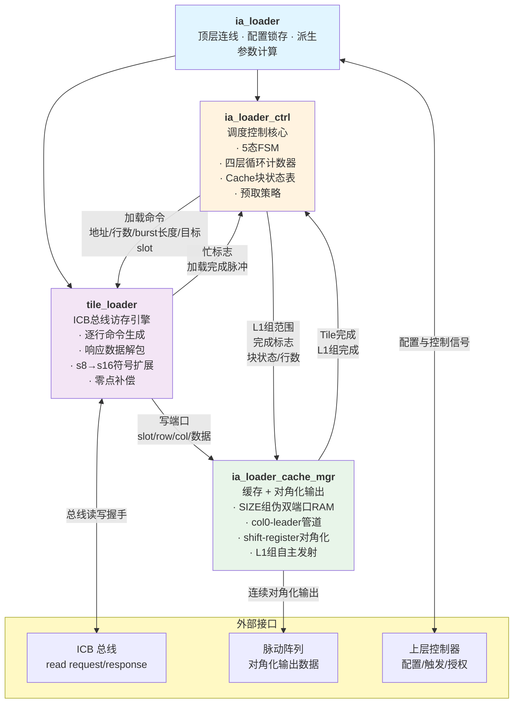
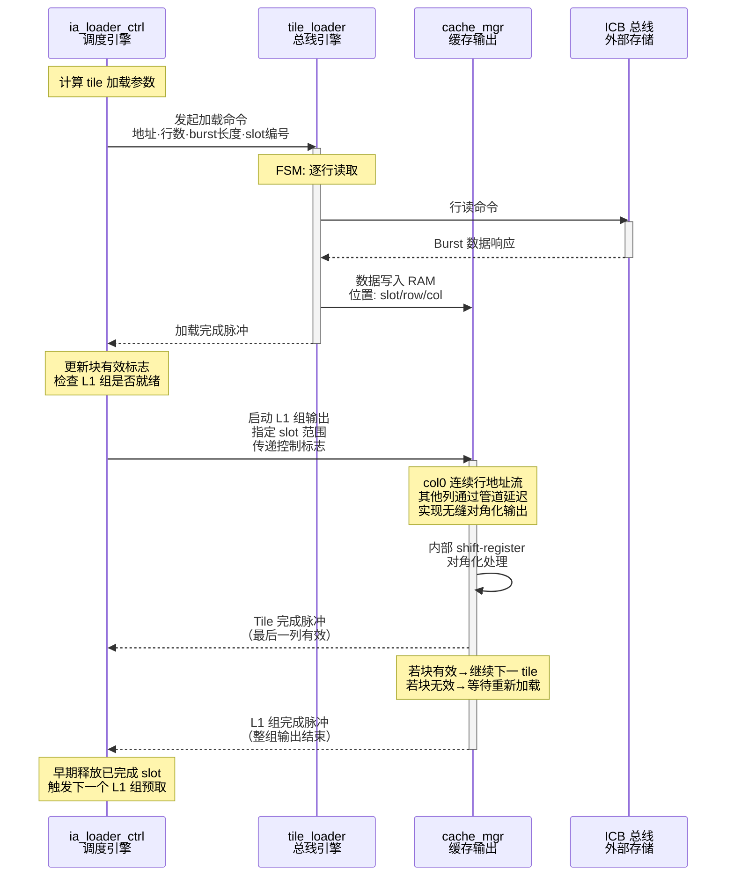
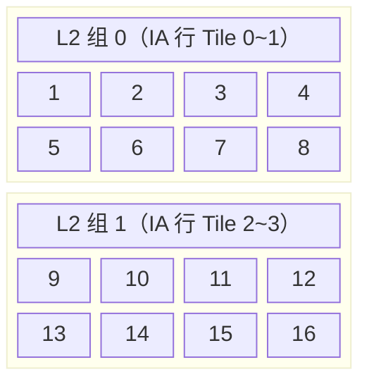
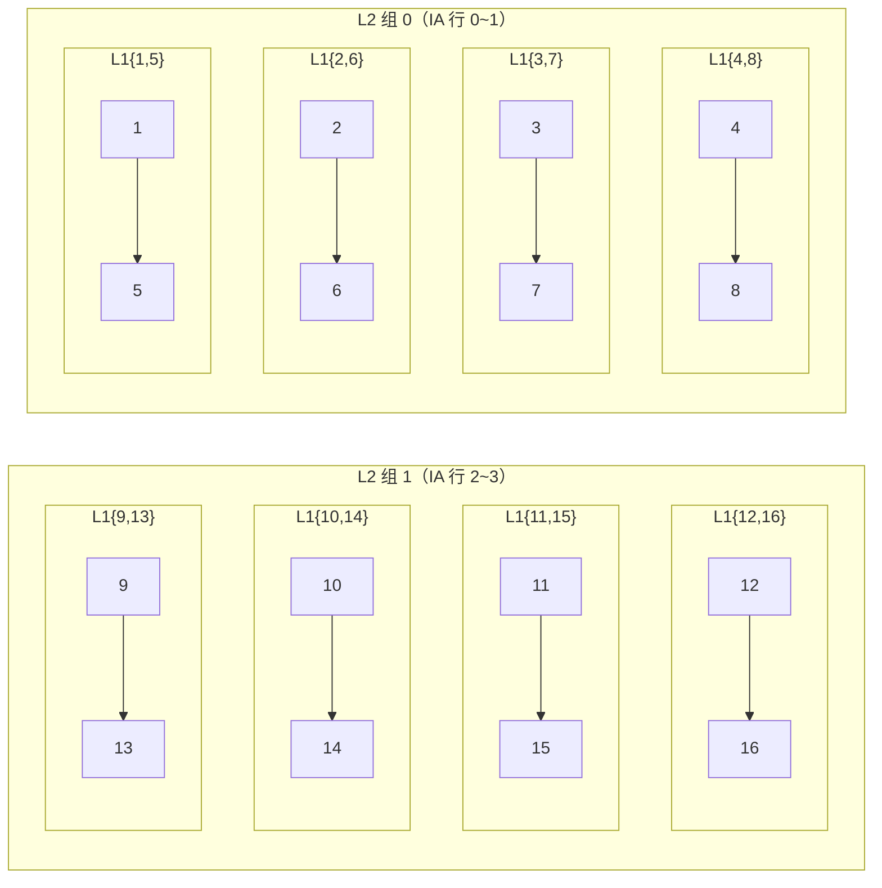
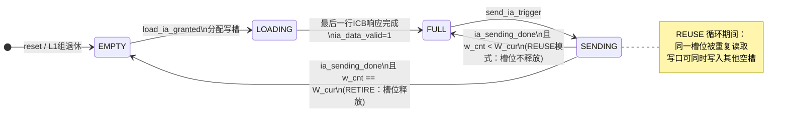
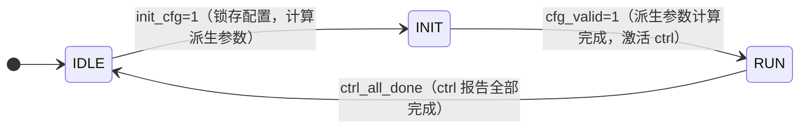
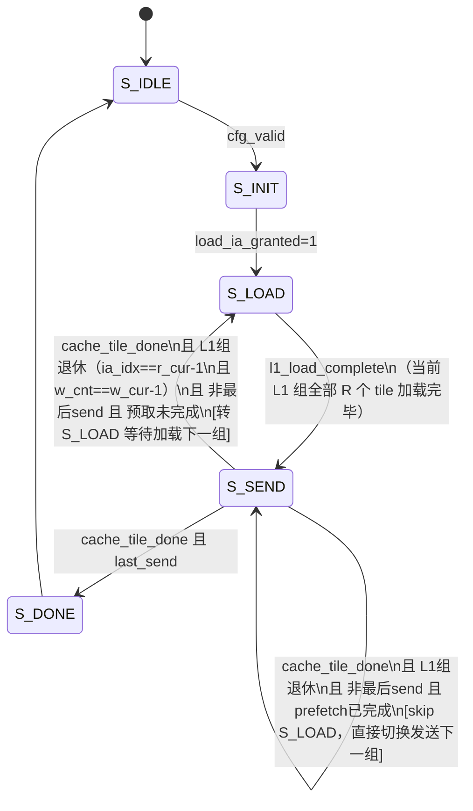

# `ia_loader` 设计文档

<!-- markdownlint-disable MD032 MD040 MD060 -->

> **版本**：v2.1  
> **更新日期**：2026-03-09  
> **依赖文档**：《DSA模块设计文档.md》（全局约定、Tile分块术语、ICB接口规范）

---

## 版本变更记录

| 版本 | 主要变化 |
|---|---|
| v1.0 | 单模块实现；单 Tile 缓存；无复用 |
| v1.1 | 多槽 RAM 缓存；L1/L2 两级复用；内置对角化输出 |
| v2.0 | **模块化重构**：拆分为 4 个子模块；引入 Cache 块状态表（valid/busy）；启用 load-send 流水机制；早期释放空闲 slot |
| **v2.1** | **L1 组连续输出**：cache_mgr 接口从单 tile 升级为 L1 组级别；引入 col0-leader + shift-register 对角化，L1 组内相邻 tile 实现零间隔无缝切换；`ia_sending_done` 语义改为 L1 组完成；控制信号从 SIZE 维数组简化为对最后一列对齐的标量 |
| v2.2 | 新增 `ia_l1_switch` 输出，用于下游 `ps_buffer` 的 L1 组切换边界控制；该脉冲由当前组末次输出边界派生，而不是简单直连 `cache_l1_done` |

---

## 0. 模块概述

`ia_loader` 负责从外部存储器中自主读取输入激活（IA）分块矩阵，将数据写入内部多槽缓存，并按 L1/L2 两级复用策略将数据输出到权重静止（Weight-Stationary）脉动阵列。

v2.1 版本在 v2.0 功能基础上进行了**对角化输出架构升级**，核心改进如下：

| 改进方向 | v2.0 行为 | v2.1 行为 |
|---|---|---|
| **模块化** | 4 个职责分明的子模块 | 不变 |
| **Cache 状态管理** | 显式 `blk_valid`/`blk_busy` 状态表 | 不变 |
| **加载-发送流水** | 状态机支持 overlap 切换 | 不变 |
| **Slot 释放** | 最后一次 reuse 完成后立即释放（早期释放） | 不变 |
| **L1 组内输出** | cache_mgr 每次只处理单个 tile，tile 间有间隔 | **cache_mgr 一次接收整 L1 组范围（slot_start/slot_end），自主完成全组无缝输出** |
| **对角化实现** | `diag_step` 计数器驱动每列不同的 rd_en/rd_addr | **col0-leader + shift-register pipeline：col0 产生连续行地址流，col j 通过 j 级移位寄存器延迟，天然形成对角化** |
| **tile 间隔** | 相邻 tile 间至少 1 拍空隙（`diag_step` 重置） | **col0 在当前 tile 最后一行发出的下一拍立即开始下一 tile，零间隔** |
| **`ia_sending_done`** | 每个 tile 完成时拉高一拍 | **整个 L1 组全部输出完成后拉高一拍** |
| **控制信号维度** | `ia_row_valid/is_init/calc_done` 为 SIZE 维数组，每维独立延迟 | **简化为标量，对齐到最后一列（col SIZE-1）延迟** |

---

## 1. 模块层级与架构设计

### 1.1 模块层级图



### 1.2 各子模块职责分工

| 子模块 | 核心职责 | 关键内部状态 |
|---|---|---|
| **`ia_loader`** | 顶层 IDLE/INIT/RUN 状态机；`init_cfg` 触发参数锁存与派生参数计算；连线各子模块 | 3 态 FSM；配置寄存器；派生参数寄存器 |
| **`ia_loader_ctrl`** | Cache 块状态表（valid/busy）；L2/L1/W/IA 四层循环计数器；tile 加载调度与发送协调；地址计算；L1 组发送触发与 `in_l1_output` 标志 | 5 态 FSM；`blk_valid[]`；`blk_busy[]`；四层循环计数器；`wr_slot_ptr`；`rd_slot_base`；`in_l1_output` |
| **`tile_loader`** | ICB 总线 Master；逐行构造读命令；接收响应后解包（s8→s16，零点补偿）并写入 cache_mgr | `active` 标志；`cmd_row_cnt`；`rsp_row_cnt`；`rsp_beat_cnt` |
| **`ia_loader_cache_mgr`** | SIZE 组伪双端口 RAM；按 slot/row/col 写入；**接收 L1 组slot范围（slot_start/slot_end），实现整组无缝对角化输出**；输出 `tile_done`/`l1_done` 完成脉冲 | `l1_issue_active`；`issue_slot_r`；`issue_row_idx_r`；`issue_rows_r`；SIZE 维 `rd_en_pipe`/`rd_addr_pipe`/`tile_last_pipe`/`l1_last_pipe` |

### 1.3 模块间交互流程



---

## 2. 参数定义

| 参数 | 默认值 | 描述 |
|---|---|---|
| `DATA_WIDTH` | `16` | 单个输入激活数据位宽（s16 / 符号扩展后的 s8） |
| `SIZE` | `16` | 脉动阵列行/列宽度；每个 Tile 尺寸为 SIZE×SIZE |
| `BUS_WIDTH` | `32` | ICB 总线数据宽度（字节数 = BUS_WIDTH/8） |
| `REG_WIDTH` | `32` | 配置寄存器位宽（地址、偏移、零点等） |
| `CACHE_BLOCKS` | `4` | 内部多组伪双端口 RAM 可同时缓存的最大 Tile 数（应 ≥ 2×ia_reuse_num） |

---

## 3. 接口定义

### 3.1 时钟与复位

| 信号 | 方向 | 位宽 | 描述 |
|---|---|---|---|
| `clk` | In | 1 | 系统时钟，上升沿有效 |
| `rst_n` | In | 1 | 异步低有效复位 |

### 3.2 配置与控制接口

| 信号 | 方向 | 位宽 | 描述 |
|---|---|---|---|
| `init_cfg` | In | 1 | 单拍脉冲，触发参数锁存，启动新一轮 GEMM |
| `load_ia_req` | Out | 1 | 模块向外部控制器申请 ICB 总线访问授权 |
| `load_ia_granted` | In | 1 | 控制器授权，模块随后进入 LOAD 状态 |
| `send_ia_trigger` | In | 1 | 单拍脉冲，触发当前已缓存 Tile 的逐行发送 |

### 3.3 矩阵尺寸配置（`init_cfg` 拉高时须稳定）

| 信号 | 方向 | 位宽 | 描述 |
|---|---|---|---|
| `k` | In | `REG_WIDTH` | IA 矩阵行数 |
| `n` | In | `REG_WIDTH` | IA 矩阵列数（= Weight 矩阵行数） |
| `m` | In | `REG_WIDTH` | 输出矩阵 OA 列数 |
| `lhs_base` | In | `REG_WIDTH` | IA 矩阵起始字节地址 |
| `lhs_row_stride_b` | In | `REG_WIDTH` | IA 矩阵行步幅（字节） |
| `lhs_zp` | In | signed `REG_WIDTH` | IA 数据零点偏移，读取后对每元素加此偏移（s32） |
| `use_16bits` | In | 1 | `1`=s16 数据；`0`=s8 数据（加载后符号扩展为 s16） |

### 3.4 复用控制配置（`init_cfg` 时锁存）

| 信号 | 方向 | 位宽 | 描述 |
|---|---|---|---|
| `ia_reuse_num` | In | `REG_WIDTH` | L1 一级组内沿 IA 行方向包含的最大 Tile 数（垂直复用粒度） |
| `w_reuse_num` | In | `REG_WIDTH` | 每次 L2 二级组循环中，OA 列方向上同时服务的权重列 Tile 数 |

### 3.5 ICB 主接口（模块作为 ICB Master）

#### 命令通道

| 信号 | 方向 | 位宽 | 描述 |
|---|---|---|---|
| `icb_cmd_valid` | Out | 1 | 命令有效 |
| `icb_cmd_ready` | In | 1 | 从端就绪；`valid & ready` 时握手 |
| `icb_cmd_read` | Out | 1 | 固定为 `1`（只读） |
| `icb_cmd_addr` | Out | `REG_WIDTH` | 读取起始字节地址 |
| `icb_cmd_len` | Out | 4 | Burst 长度减一（按节拍数） |

#### 响应通道

| 信号 | 方向 | 位宽 | 描述 |
|---|---|---|---|
| `icb_rsp_valid` | In | 1 | 响应数据有效 |
| `icb_rsp_ready` | Out | 1 | 模块就绪接收 |
| `icb_rsp_rdata` | In | `BUS_WIDTH` | 读取数据 |
| `icb_rsp_err` | In | 1 | 总线错误标志（当前版本忽略） |

### 3.6 输出到脉动阵列（含对角化延时）

> v2.1 中对角化由 cache_mgr 内部 shift-register pipeline 实现，`ia_out[SIZE]` 仍为 SIZE 维数组（每列对应脉动阵列的一列输入），但控制信号简化为标量，对齐到最后一列（col SIZE-1）的时序。

| 信号 | 方向 | 位宽 | 描述 |
|---|---|---|---|
| `ia_out[SIZE]` | Out | `signed [DATA_WIDTH-1:0]` | 各列输出数据；`ia_out[j]` 相对列 0 延迟 j 拍（由 shift-register 保证） |
| `ia_row_valid` | Out | `logic` | **标量**，高电平表示 `ia_out[SIZE-1]`（最后一列）有效；以此为基准，col j 的有效时刻为 `ia_row_valid` 在时间上向前偏移 `SIZE-1-j` 拍时的 `ia_out[j]` 非零判断 |
| `ia_is_init_data` | Out | `logic` | **标量**，对齐至最后一列：当前 L1 组为该 OA 累加序列首组时在输出期间为高 |
| `ia_calc_done` | Out | `logic` | **标量**，对齐至最后一列：当前 L1 组为 L2 组最后一个 L1 组时在输出期间为高 |
| `ia_sending_done` | Out | 1 | 单拍脉冲，**整个 L1 组**（含所有 tile 的对角化拖尾）全部发出后拉高一拍 |
| `ia_l1_switch` | Out | 1 | 单拍脉冲，用于标记 **L1 组切换前的最后一次输出**；仅在后续还会输出新的 L1 组时拉高，供 `ps_buffer` 进行边界回卷 |
| `ia_data_valid` | Out | 1 | L1 组首个 slot 已加载完毕且当前不在 L1 输出中，可接受 `send_ia_trigger` |
| `bias_sleep` | Out | 1 | 外部 bias mux 屏蔽信号；当前 L1 组属于 init group 时保持低电平，非 init group 时拉高 |
| `bias_switch` | Out | 1 | 单拍脉冲；与 `ia_sending_done` 同拍，仅在 `bias_sleep=0` 时发出，用作 bias block 切换边界 |
| `bias_last_loop` | Out | 1 | 最后一个 L2 组标志；为 `1` 时表示当前已经进入最后一次轮回，bias_loader 不应再回卷到第一个 bias block |

---

## 4. 功能描述

### 4.1 ICB 自主访存

模块以 ICB Master 方式自主计算每个 Tile 的起始地址与 Burst 长度，逐行发出读请求，并将响应数据解包（含符号扩展与零点偏移）后写入内部缓存 RAM。

关键访存参数（`init_cfg` 时计算并锁存）：

```
horizontal_tile_num = ceil(n / SIZE)     // 每矩阵行方向 Tile 数
vertical_tile_num   = ceil(k / SIZE)     // 列方向 Tile 数
loop_row_num        = ceil(m / SIZE)     // 每行 IA Tile 被复用的次数（对应 OA 列方向 Tile 数）
row_tile_rem        = horizontal_tile_num * SIZE - n   // 最后列 Tile 的无效列数
col_tile_rem        = vertical_tile_num  * SIZE - k   // 最后行 Tile 的无效行数
```

最后一列（列方向最后 Tile）无效列的权重在 `kernel_loader` 侧置零，因此 IA 侧无需补零；  
最后一行（行方向最后 Tile）无效行完全跳过访存以节约带宽。

---

### 4.2 块级缓存与两级复用

#### 4.2.1 术语与符号定义

| 符号 | 含义 |
|---|---|
| `HTN` | `horizontal_tile_num` = ceil(n/SIZE)，IA 行方向 Tile 数 |
| `VTN` | `vertical_tile_num` = ceil(k/SIZE)，IA 列方向（垂直方向）Tile 数 |
| `LRN` | `loop_row_num` = ceil(m/SIZE)，OA 列方向 Tile 数，等同于每行 IA Tile 被复用的次数 |
| `R` | `ia_reuse_num`，L1 组沿 IA 垂直方向包含的最大 Tile 槽数（配置值） |
| `W` | `w_reuse_num`，每次 L2 组遍历中并行服务的 OA 列方向 Tile 数（配置值） |
| `R_act` | `ia_reuse_num_act`，最后一个 L1 组的实际有效 Tile 数（≤ R） |
| `W_act` | `w_reuse_num_act`，最后一个 L2 组最后一轮的实际有效 L1 组数（≤ W） |
| `G2` | L2 组总数 = ceil(VTN / R) |
| `G1` | 每 L2 组内的 L1 组数 = ceil(LRN / W) |

#### 4.2.2 两级分组结构

IA 矩阵按 Tile 编号排列（行主序），以 4 行 × 4 列 Tile 矩阵（`R=2, W=2`）为例：



**L1 组（一级组）**：沿 IA **垂直方向**由连续 `R` 个 Tile 构成的最小复用单元。
- L1 组由 `ia_reuse_num` 控制其垂直深度。
- 示例中 `{1,5}`, `{2,6}`, `{3,7}`, `{4,8}` 各为一个 L1 组。
- 同一 L1 组的全部 Tile 占用连续的 RAM 槽位，生命周期相同（同时加载，同时释放）。

**L2 组（二级组）**：沿 OA **列方向**由 `G1` 个 L1 组构成的完整计算轮次。
- 完成一个 L2 组即完成 OA 中连续 `R × SIZE` 行对应的全部部分和累加。
- 示例中 L2 组 0 = `{1,5}, {2,6}, {3,7}, {4,8}`。



#### 4.2.3 控制计数器与循环层次

模块维护三个嵌套计数器，共同描述当前发送位置：

| 计数器 | 范围 | 进位条件 | 说明 |
|---|---|---|---|
| `ia_idx` | `0 .. R_act-1` | 到达 `R_act-1` | L1 组内 Tile 轮转索引（行方向偏移） |
| `w_cnt` | `0 .. W_cur-1` | `ia_idx` 进位 | L1 组内 W 轴循环计数；`W_cur = W_act`（最后轮）或 `W` |
| `l1_idx` | `0 .. G1-1` | `w_cnt` 进位 | L2 组内 L1 组索引（OA 列方向） |
| `l2_idx` | `0 .. G2-1` | `l1_idx` 进位 | L2 组索引（IA 行方向） |

嵌套循环伪代码（硬件实现为计数器自增/清零，仅用于说明语义）：

```
for l2_idx in 0 .. G2-1:                         // 遍历所有 L2 组
  load L1 groups of current L2 into RAM slots     // 预加载本 L2 组的首批 L1 组
  for l1_idx in 0 .. G1-1:                        // 遍历 L2 组内所有 L1 组
    W_cur = (l1_idx == G1-1) ? W_act : W          // 当前轮实际循环次数
    for w_cnt in 0 .. W_cur-1:                    // 对当前 L1 组循环 W_cur 次
      for ia_idx in 0 .. R_cur-1:                 // R_cur = (l2_idx==G2-1 last group) ? R_act : R
        send Tile[l2_idx*R + ia_idx][l1_idx*W + (w_cnt? reuse col)]
    // L1 组循环结束，释放该组 RAM 槽位
    // 若缓存有空余，立即预加载后续 L1 组（读写并发）
```

发送顺序的完整展开（示例参数 R=2, W=2, 4×4 Tile 矩阵）：

```
L2 组 0：
  L1 组 0 {1,5}  → 循环 W=2 次 → 发送序列：1 → 5 → 1 → 5
  L1 组 1 {2,6}  → 循环 W=2 次 → 发送序列：2 → 6 → 2 → 6
  L1 组 2 {3,7}  → 循环 W=2 次 → 发送序列：3 → 7 → 3 → 7
  L1 组 3 {4,8}  → 循环 W=2 次 → 发送序列：4 → 8 → 4 → 8
                                              ↑
                                  ia_calc_done 在此 L1 组的全部发送中置高

L2 组 1：
  L1 组 0 {9,13}  → 循环 W=2 次 → 9 → 13 → 9 → 13
  ... （同上）
```

#### 4.2.4 操作模式与 RAM 槽位状态

模块定义如下三种槽位操作模式，在每个时钟周期可同时处于两种模式（读写并发）：

| 模式 | 触发条件 | 槽位写口行为 | 槽位读口行为 |
|---|---|---|---|
| **PRELOAD**（预加载） | `load_ia_granted` 且存在空闲槽 | 向空闲槽写入 ICB 响应数据（逐行） | 不操作或读取发送槽 |
| **REUSE**（复用发送） | 收到 `send_ia_trigger`，`w_cnt < W_cur` | 不写（读写并发时写预加载槽） | 顺序读取当前 L1 组槽位，逐行发出 |
| **RETIRE**（槽位释放） | `w_cnt` 达到 `W_cur`，L1 组循环结束 | 当前 L1 组槽位标记为空闲，可复用 | — |



#### 4.2.5 `ia_calc_done` 断言条件

`ia_calc_done` 为组合逻辑条件，在以下所有条件同时成立时，于发送有效期间（`ia_row_valid` 为高）持续拉高：

```
ia_calc_done_base = (l1_idx == G1 - 1)     // 当前 L1 组为 L2 组最后一个 L1 组
                    && (state == SEND)
                    && ia_row_valid_base
```

该信号表示当前 IA Tile 参与的是该 OA 元素的最后一次部分和累加，下游累加器在收到此信号后可启动写回流程。对角化延迟链将此信号同步复制到各列输出端（见 3.4.2 节）。

#### 4.2.6 预加载流水与缓存容量约束

伪双端口 RAM 的写端口与读端口指向不同槽位时可完全并发，因此 PRELOAD 模式与 REUSE 模式可以重叠执行：

```mermaid
gantt
  title 槽位时序（CACHE_BLOCKS=4, R=2, W=2）
  dateFormat  X
  axisFormat %s

  section 槽位 0 (Tile 1)
    LOADING  : 0, 3
    SENDING×4: 3, 11
    RETIRE   : 11, 12

  section 槽位 1 (Tile 5)
    LOADING  : 2, 5
    SENDING×4: 5, 13
    RETIRE   : 13, 14

  section 槽位 2 (Tile 2)
    LOADING  : 3, 6
    SENDING×4: 12, 20
    RETIRE   : 20, 21

  section 槽位 3 (Tile 6)
    LOADING  : 5, 8
    SENDING×4: 14, 22
    RETIRE   : 22, 23
```



> **容量约束**：为保证预加载不被阻塞，需满足 `CACHE_BLOCKS ≥ 2 × R`。若缓存紧张，预加载将在有空闲槽时才会启动，功能仍正确但流水线效率下降。

#### 4.2.7 边界处理：`_act` 实际值的预计算

当 `VTN` 或 `LRN` 不是 `R`/`W` 的整数倍时，最后一个分组的有效元素数不足额定值。引入 `_act` 后缀寄存器在 `init_cfg` 时一次性预计算并锁存，后续直接用于控制逻辑，避免运行时判断：

| 寄存器 | 计算式（无除法，使用移位/加法） | 含义 |
|---|---|---|
| `ia_reuse_num_act` | `VTN[log2(R)-1:0]`，为零时取 `R` | 最后 L1 组实际 Tile 数 |
| `w_reuse_num_act`  | `LRN[log2(W)-1:0]`，为零时取 `W` | 最后 L2 轮最后 L1 组实际循环次数 |
| `l2_group_num`     | `(VTN + R - 1) >> log2(R)` | L2 组总数 G2 |
| `l1_per_l2`        | `(LRN + W - 1) >> log2(W)` | 每 L2 组内 L1 组数 G1 |

此处假定 `R` 和 `W` 均为 2 的幂次，则取模运算等价于截取低位，无需额外硬件。非 2 幂次情形需使用减法比较代替位截取，但计算仍在 `init_cfg` 时完成，不影响运行时关键路径。

---

### 4.3 内部多组伪双端口 RAM 架构

模块内部配置 **SIZE 组伪双端口 RAM**（Pseudo Dual-Port RAM），每组对应矩阵的一列：

```
RAM 组织：

  ram_bank[j]（j = 0 .. SIZE-1）：
    深度 = CACHE_BLOCKS × SIZE   // CACHE_BLOCKS 个 Tile，每 Tile SIZE 行
    宽度 = DATA_WIDTH             // 存储该列的一个元素

  写端口（LOAD 阶段驱动）：
    wr_addr[j] = slot_wr × SIZE + row_wr
    wr_data[j] = 解包后的第 j 列数据

  读端口（SEND 阶段驱动，带对角偏移）：
    rd_addr[j] = slot_rd × SIZE + (diag_step - j)    // diag_step = 发送时钟步
    rd_en[j]   = (diag_step >= j) && (diag_step - j < valid_rows)
```

写入操作与读取操作不冲突（写入未发送槽，读取正在发送槽），故可以并行进行，实现读写流水。

---

### 4.4 内置对角化输出（Diagonal Skewing）

#### 4.4.1 原理：col0-leader + shift-register pipeline

脉动阵列要求 IA 数据在空间上错位输入（斜向对齐）：第 j 列的数据需要比第 0 列晚 j 个时钟周期到达。

v2.1 采用 **col0-leader + shift-register pipeline** 实现：
- **col0（领头列）**：cache_mgr 内部直接控制 col0 的 `src_rd_en` 和 `src_rd_addr`，col0 以连续不间断的节奏发射行地址（每拍一行，跨 tile 时无间隔）。
- **移位寄存器管线**（`rd_en_pipe[SIZE]` / `rd_addr_pipe[SIZE]`）：`rd_en_pipe[0] = src_rd_en`，`rd_en_pipe[j] = rd_en_pipe[j-1]`（每级延迟 1 拍）。列 j 的 RAM 读使能来自 `rd_en_pipe[j]`，自然获得 j 拍延迟，无需单独的 `diag_step` 比较逻辑。
- **跨 tile 无缝切换**：col0 在当前 tile 最后一行（`issue_row_idx == vrows-1`）发射后，若下一 slot `blk_valid_in` 为 1，则下一拍立即开始下一 tile 的第 0 行（`issue_row_idx` 归零，`issue_slot_r` 递增）。col1..SIZE-1 此时仍在输出上一 tile 的尾部，两者自然重叠，整体输出流无间隙。

```
col0 输出的行序列（L1 组含 2 个 tile，vrows 均为 3，SIZE=4）：

时钟拍:   0     1     2     3     4     5
col0:  T0R0  T0R1  T0R2  T1R0  T1R1  T1R2   ← col0 无间隔切换
col1:   -    T0R0  T0R1  T0R2  T1R0  T1R1   T1R2
col2:   -      -   T0R0  T0R1  T0R2  T1R0   T1R1  T1R2
col3:   -      -     -   T0R0  T0R1  T0R2   T1R0  T1R1  T1R2

ia_row_valid（= ram_rd_en_d1[SIZE-1]）:
         -      -     -     -   有效   有效   有效  有效  有效

总输出拍 = Σvrows_i + SIZE - 1 = 3 + 3 + 4 - 1 = 9 拍
```

相比 v2.0 的 `diag_step` 方案，每个 tile 间不再有重置间隔，两个 tile 的输出流连续叠加。

#### 4.4.2 tile/L1 完成脉冲的产生

移位管线中额外传播两个 marker：
- `tile_last_pipe[SIZE]`：col0 在当前 tile 最后一行时置 1，随移位链传播，到达 `tile_last_pipe[SIZE-1]` 时（即最后一列实际输出该行）发出 `tile_done` 脉冲。
- `l1_last_pipe[SIZE]`：在 L1 组最后一个 tile 的最后一行时置 1，传播到最后一列后发出 `l1_done` 脉冲。

```
tile_done = rd_en_pipe[SIZE-1] && tile_last_pipe[SIZE-1]
l1_done   = rd_en_pipe[SIZE-1] && l1_last_pipe[SIZE-1]
```

`l1_done` 在最后一列输出 L1 组最后一行时才拉高，确保所有数据已发出。`ia_sending_done` 直通自 `cache_l1_done`（= `l1_done`）。

#### 4.4.3 控制信号（ia_is_init_data / ia_calc_done）

`send_is_init_r` 和 `send_calc_done_r` 在 `l1_start` 时锁存，整个 L1 组期间保持不变。输出时与 `ram_rd_en_d1[SIZE-1]`（即 `ia_row_valid`）做与运算：

```systemverilog
assign ia_is_init_data = ram_rd_en_d1[SIZE-1] & send_is_init_r;
assign ia_calc_done    = ram_rd_en_d1[SIZE-1] & send_calc_done_r;
```

无需每列单独延迟链，标量形式对齐至最后一列时序。

---

### 4.5 cache_mgr 发射调度逻辑（v2.1）

cache_mgr 内部有独立的 **L1 组发射引擎**，通过 `l1_issue_active` 标志替代显式 FSM 状态：

```
l1_start 脉冲（来自 ctrl）：
  l1_issue_active ← 1
  issue_slot_r    ← l1_slot_start
  l1_slot_end_r   ← l1_slot_end
  issue_row_idx_r ← 0
  issue_rows_r    ← slot_rows[l1_slot_start]

每拍（当 l1_issue_active && blk_valid_in[issue_slot_r]）：
  src_rd_en   ← 1
  src_rd_addr ← {issue_slot_r, issue_row_idx_r}

  if issue_row_idx_r == issue_rows_r - 1:   // 当前 tile 最后一行
    src_tile_last ← 1
    if issue_slot_r == l1_slot_end_r:        // L1 组最后一个 tile
      src_l1_last     ← 1
      l1_issue_active ← 0
    else:                                     // 切换到下一 tile
      issue_slot_r    ← issue_slot_r + 1
      issue_row_idx_r ← 0
      issue_rows_r    ← slot_rows[next_slot]
  else:
    issue_row_idx_r ← issue_row_idx_r + 1

// 若当前 slot 尚未 valid（blk_valid_in[issue_slot_r] == 0），发射引擎等待（src_rd_en 不拉高）
```

当下一 slot 尚未加载完成时，发射引擎自动等待（col0 暂停），一旦 `blk_valid_in` 置位则立即恢复，保证 load-send overlap 场景下的正确性。

---

### 4.6 状态机（v2.1）

#### 顶层 FSM（ia_loader）— 不变



#### 控制核心 FSM（ia_loader_ctrl）— v2.1 更新



> **v2.1 关键变化**：循环计数器推进触发信号由 `cache_send_done` 改为 `cache_tile_done`；ctrl 只在 L1 组开始时发出一次 `cache_l1_start`，cache_mgr 自主完成整组。**预取策略升级**：新增 `spare_capacity` 判断——当 `r_cur + next_r_cur ≤ CACHE_BLOCKS` 时，进入 S_SEND 后立即激活 `prefetch_active`，tile_loader 在第一轮 W 复用期间就开始后台加载下一 L1 组；否则（缓冲区紧张）兜底在最后一轮（`w_cnt == w_cur-1`）才开始预取。退休时若预取已完成（`prefetch_active && l1_load_complete`），FSM 直接从 S_SEND 跳至 S_SEND，完全跳过 S_LOAD。

各状态职责：

| 状态 | 主要职责 | 关键输出 |
|---|---|---|
| `S_IDLE` | 等待，保持所有输出无效 | — |
| `S_INIT` | 初始化计数器/状态表；请求总线授权 | `load_ia_req=1` |
| `S_LOAD` | 驱动 `tile_loader` 逐 tile 加载当前 L1 组；监听 `tl_tile_done` 更新 `blk_valid`；若 `prefetch_active` 已在进入 S_LOAD 前激活，则同时也为下一组加载 | `tl_start`（脉冲）；`blk_valid[slot]←1` |
| `S_SEND` | 等待 `tile_done` 推进计数器；通过 `in_l1_output` 标志防止重复触发；同时通过 `prefetch_active` 后台驱动 `tile_loader` 预取下一 L1 组（`spare_capacity` 成立时从第一轮 W 开始，否则在最后一轮） | `cache_l1_start`（L1 组 trigger 时一次脉冲）；`ia_data_valid`；间接触发 `tl_start`（预取） |
| `S_DONE` | 拉高 `all_done` 一拍 | `all_done=1` |

**ia_data_valid / in_l1_output / ia_sending_done 逻辑（v2.1）**：

```systemverilog
// ia_data_valid: L1 组首个 slot ready 且当前不在 L1 输出中
assign ia_data_valid = (state == S_SEND || state == S_LOAD)
                     && blk_valid[rd_slot_base]
                     && !in_l1_output;

// in_l1_output: 防止同一 L1 组被重复触发
always_ff @(posedge clk or negedge rst_n) begin
  if (!rst_n) in_l1_output <= 0;
  else if (send_ia_trigger && ia_data_valid) in_l1_output <= 1;
  else if (cache_l1_done)                   in_l1_output <= 0;
end

// cache_l1_start: send_ia_trigger 接受时发出一次脉冲
assign cache_l1_start = (state == S_SEND || state == S_LOAD)
                      && send_ia_trigger && ia_data_valid;

// ia_sending_done: L1 组全部输出完成（cache_mgr 的 l1_done 直通）
assign ia_sending_done = cache_l1_done;
```

---

## 5. 关键参数预计算一览

以下所有参数均在 `init_cfg` 时一次性计算并锁存为寄存器，计算避免除法（均使用移位与加法）：

| 寄存器 | 计算式 | 说明 |
|---|---|---|
| `horizontal_tile_num` | `(n + SIZE-1) >> log2(SIZE)` | 行方向 Tile 数 |
| `vertical_tile_num` | `(k + SIZE-1) >> log2(SIZE)` | 列方向 Tile 数 |
| `l2_group_num` | `(VTN + R - 1) >> log2(R)` | 总 L2 组数 G2 |
| `l1_per_l2` | `HTN`（每 L1 组对应一列 Tile） | 每 L2 组内 L1 组数 G1 |
| `ia_reuse_num_act` | `VTN & (R-1)`，为 0 时取 `R` | 最后 L1 组实际 Tile 数 |
| `rsp_rows_last_tile` | `SIZE - ((VTN<<log2(SIZE)) - k)` | 最后行 Tile 有效行数 |
| `rsp_beats_per_row_normal` | `ceil(SIZE × bytes_per_elem / BYTES_PER_BEAT)` | 普通 Tile 每行 Burst 节拍数 |
| `rsp_beats_per_row_last` | `ceil(last_cols × bytes_per_elem / BYTES_PER_BEAT)` | 最后列 Tile 每行节拍数 |

> R、W 均要求为 2 的幂次，取模等价于低位截取，无需除法器。派生参数在 `IDLE` 期间通过 `init_cfg` 一次性写入寄存器，不进入运行时关键路径。

---

## 6. 子模块设计详解

### 6.1 `ia_loader`（顶层连线模块）

**设计思路**：顶层模块只负责「外部契约」——对外暴露接口、锁存原始配置、计算派生参数，不含任何调度或访存逻辑，使三个子模块可以独立综合和测试。

**派生参数计算流程**（在 `IDLE` 状态 `init_cfg` 脉冲时触发，一拍完成）：

```
init_cfg=1 时同步执行（SystemVerilog always_ff）：
  cfg_k/n/m/base/stride/zp/... ← 输入端口
  horizontal_tile_num ← (n + SIZE-1) >> LOG2_SIZE
  vertical_tile_num   ← (k + SIZE-1) >> LOG2_SIZE
  l2_group_num        ← (VTN + R-1) >> log2(R)
  l1_per_l2           ← HTN
  ia_reuse_num_act    ← (VTN & (R-1)) == 0 ? R : VTN & (R-1)
  rsp_beats_per_row_* ← ceil(SIZE*bytes / BEAT_BYTES)
  rsp_rows_last_tile  ← SIZE - col_tile_rem
  cfg_valid           ← 1'b1  // 下一拍激活 ctrl
```

派生参数以独立信号线送入 `ia_loader_ctrl`，避免 ctrl 内部重复计算。

---

### 6.2 `ia_loader_ctrl`（调度控制核心）

**设计思路**：将所有调度决策集中在这个模块，消除 v1.1 中散布在大型状态机各分支里的隐式逻辑，每个关键功能有明确对应的寄存器或逻辑块。

#### 6.2.1 Cache 块状态表

```
blk_valid[CACHE_BLOCKS]  // bit[i]=1：slot i 数据完整，可被发送
blk_busy [CACHE_BLOCKS]  // bit[i]=1：slot i 正被发送占用，不可覆写
```

状态更新规则（v2.1 更新）：

| 事件 | 动作 |
|---|---|
| `tl_tile_done`（tile_loader 完成一个 tile） | `blk_valid[tl_slot_id] ← 1` |
| `cache_l1_start`（L1 组发送启动） | `blk_busy[cache_l1_slot_start] ← 1`（首个 slot） |
| `cache_tile_done`（单 tile 输出完成） | `blk_busy[current_rd_slot] ← 0`；若下一 tile 存在则 `blk_busy[next_rd_slot] ← 1` |
| `cache_tile_done` 且 `w_cnt == w_cur-1` | `blk_valid[current_rd_slot] ← 0`（早期释放） |
| `S_INIT` 复位 | 所有位清零 |

> **关键变化（v2.1）**：因为 cache_mgr 现在自主处理 L1 组内的全部 tile 切换，ctrl 不再逐 tile 发送 `cache_send_start`，blk_busy 的推进改为由 `cache_tile_done` 驱动（tile 完成时同步更新 busy 位到下一个 slot）。

#### 6.2.2 Slot 分配策略

```
wr_slot_ptr :  下一个写入的 slot 索引（循环递增，每完成一个 tl_tile_done +1）
rd_slot_base:  当前 L1 组的 slot 读基地址（L1 组退休时 ← wr_slot_ptr）

current_rd_slot = rd_slot_base + ia_idx  // 当前发送的 slot
```

Slot 以循环队列方式分配。新的 L1 组总是从 `wr_slot_ptr` 开始写入，不提前释放直到最后一次 reuse 完成。由于 `CACHE_BLOCKS ≥ 2×R`，写指针不会追上读基地址。

#### 6.2.3 加载触发逻辑（can_start_load）

```systemverilog
assign can_start_load = ((state == S_LOAD) || (state == S_SEND && prefetch_active))
                      && !tl_busy                    // tile_loader 空闲
                      && (load_ia_cursor < load_r_target)  // 还有 tile 需要加载（prefetch 时目标为 next_r_cur）
                      && !blk_busy[wr_slot_ptr]      // 目标 slot 未被发送占用
                      && !blk_valid[wr_slot_ptr]     // 目标 slot 无有效数据（防覆写）
                      && !l1_load_complete;           // 防止 done 与状态切换间隙误触发
```

`(state == S_SEND && prefetch_active)` 使得 S_SEND 期间可以同时驱动 tile_loader 加载下一组；`load_r_target` 在 `prefetch_active` 时取 `next_r_cur`，否则取 `r_cur`。`!l1_load_complete` 防止 R=1 等极端场景下的 double-load。`!blk_valid[wr_slot_ptr]` 确保循环回绕时不覆盖尚未退休的 slot（与 `!blk_busy` 共同构成写安全检查）。

#### 6.2.4 地址计算

```
L2 行基地址（l2_row_base）：
  初始值 = cfg_lhs_base
  每个 L2 组结束时 += cfg_ia_reuse_num × SIZE × cfg_lhs_row_stride_b

当前 tile 基地址（computed_tile_base）：
  = l2_row_base
  + load_ia_cursor × SIZE × cfg_lhs_row_stride_b   // 组内 tile 行偏移
  + tile_col_idx × SIZE × bytes_per_elem            // 列方向字节偏移
```

所有乘法均为 2 的幂次乘以常量，综合后为移位加法，不产生真正的乘法器。

---

### 6.3 `tile_loader`（ICB 访存引擎）

**设计思路**：将 ICB 协议的状态处理封装为一个自包含的「加载命令执行器」——输入一次加载命令（base, rows, burst_len, slot），输出一次 `tile_done` 脉冲，中间过程完全自治。

**内部数据流**：

```
start 脉冲
  ↓ 锁存参数（cfg_base_addr, cfg_rows, cfg_burst_len_m1, cfg_slot, ...）
  ↓
[行命令发送循环]
  icb_cmd_valid ← 1, icb_cmd_addr = current_row_addr
  cmd_hs → cmd_row_cnt++, current_row_addr += row_stride
  （继续直到 cmd_row_cnt == cfg_rows）
  ↓
[响应接收循环]
  rsp_hs → 解包 rsp_rdata：
     s8 模式：每 beat 4 bytes → 4 个 s8 → 符号扩展 + lhs_zp → 4 个 s16
     s16 模式：每 beat 4 bytes → 2 个 s16 + lhs_zp → 2 个 s16
     → wr_data[i], wr_valid[i] 驱动 cache_mgr 写端口
  rsp_beat_cnt++；行尾 beat → rsp_row_cnt++
  最后一行最后一 beat → tile_done=1, active←0
```

**cmd/rsp 解耦**：命令发送与响应接收可以并发（ICB 流水），`cmd_row_cnt` 与 `rsp_row_cnt` 独立计数，rsp 可以在下一行 cmd 发出前就开始接收。

---

### 6.4 `ia_loader_cache_mgr`（RAM + col0-leader 对角化输出）

**设计思路（v2.1）**：cache_mgr 不再是「被动执行单 tile 发送命令」的数据平面，而是「接收 L1 组范围后自主完成整组连续对角化输出」的自治单元。核心架构从 `diag_step` 计数器驱动改为 col0-leader + shift-register pipeline。

**RAM 组织**（SIZE 个独立 bank，天然行列分离）：

```
bank[j] 存储所有 slot 的第 j 列数据：
  地址 = slot × SIZE + row_within_tile
  宽度 = DATA_WIDTH（s16）
  深度 = CACHE_BLOCKS × SIZE
```

**L1 组发射引擎**（核心新机制）：

```
接口输入（来自 ctrl）：
  l1_start      — 脉冲，触发新的 L1 组发射
  l1_slot_start — L1 组起始 slot（= rd_slot_base）
  l1_slot_end   — L1 组结束 slot（= rd_slot_base + r_cur - 1，自然回绕）
  l1_is_init    — 本 L1 组是否为 OA 首次累加（is_init 标记）
  l1_calc_done  — 本 L1 组是否为 L2 组最后一个 L1 组
  blk_valid_in  — ctrl 提供的实时 slot 有效状态（共 CACHE_BLOCKS 位）
  slot_rows[]   — 每个 slot 的有效行数（ctrl 在 tl_tile_done 时写入）

发射状态寄存器：
  l1_issue_active  — 发射进行中标志
  issue_slot_r     — 当前正在处理的 slot
  l1_slot_end_r    — 锁存的结束 slot
  issue_row_idx_r  — 当前 slot 内下一次发射的行号
  issue_rows_r     — 当前 slot 的有效行数
```

**col0 源信号生成**：

```systemverilog
// 每拍，当 l1_issue_active 且当前 slot 已 valid，发射一行
if (l1_issue_active && blk_valid_in[issue_slot_r]) begin
  src_rd_en   = 1;
  src_rd_addr = {issue_slot_r, issue_row_idx_r};

  if (issue_row_idx_r == issue_rows_r - 1) begin   // 当前 tile 最后一行
    src_tile_last = 1;
    if (issue_slot_r == l1_slot_end_r) begin        // L1 最后一个 tile
      src_l1_last     = 1;
      l1_issue_active = 0;                          // 结束发射
    end else begin
      issue_slot_r    = issue_slot_r + 1;           // 切换下一 tile（零间隔）
      issue_row_idx_r = 0;
      issue_rows_r    = slot_rows[next_slot];
    end
  end else begin
    issue_row_idx_r = issue_row_idx_r + 1;
  end
end
```

**shift-register pipeline**（对角化核心）：

```
rd_en_pipe[0]     = src_rd_en
rd_en_pipe[j]     = rd_en_pipe[j-1]     （j = 1..SIZE-1，每级 FF 延迟 1 拍）
rd_addr_pipe[j]   = rd_addr_pipe[j-1]   （同上）
tile_last_pipe[j] = tile_last_pipe[j-1]
l1_last_pipe[j]   = l1_last_pipe[j-1]

// RAM 读端口
ram_rd_en[j]   = rd_en_pipe[j]
ram_rd_addr[j] = rd_addr_pipe[j]

// 输出（RAM 读延迟 1 拍）
ram_rd_en_d1[j] ← ram_rd_en[j]  （寄存一拍）
ia_out[j] = ram_rd_en_d1[j] ? ram_rd_data[j] : '0

// 完成脉冲
tile_done = rd_en_pipe[SIZE-1] && tile_last_pipe[SIZE-1]
l1_done   = rd_en_pipe[SIZE-1] && l1_last_pipe[SIZE-1]

// 标量控制信号（对齐最后一列）
ia_row_valid   = ram_rd_en_d1[SIZE-1]
ia_is_init_data = ram_rd_en_d1[SIZE-1] && send_is_init_r
ia_calc_done    = ram_rd_en_d1[SIZE-1] && send_calc_done_r
```

**等待（wait）行为**：当发射引擎正在处理某个 slot 但该 slot 尚未 valid（`blk_valid_in[issue_slot_r] == 0`），发射引擎暂停（`src_rd_en` 不拉高），shift-register pipeline 自然地保持空闲（全 0）。load-send overlap 场景下，tile 加载完成后 `blk_valid_in` 置 1，发射引擎立即从等待点恢复。

---

## 7. 访存管理与 Cache 优化设计

### 7.1 访存模式分析

IA 矩阵访存具有以下特征：

| 特征 | 说明 |
|---|---|
| **强局部性** | L1 组内 R 个 tile 在 IA 矩阵中相邻（连续行），行步幅固定 |
| **高复用性** | 每个 tile 被重用 **W 次**（W 轴循环）+ **L1_per_L2 次**（L2 外层循环），单次加载多次读取 |
| **流式可预测** | 整个访问模式在 `init_cfg` 时完全确定，无分支，适合静态调度 |
| **边界不对齐** | 最后行/列 tile 的有效元素数可能不是 SIZE 的整数倍 |

针对上述特征，v2.1 的访存策略：

```
减少冗余访存 = 最大化每次加载的复用次数 (W × W_avg_reuse_per_L2)
带宽利用率 = 有效元素数 / (burst 拍数 × BYTES_PER_BEAT)
           = SIZE×bytes / ceil(SIZE×bytes / BEAT_W) × BEAT_W
           ≥ 1 - (BEAT_W-1)/(SIZE×bytes)  // 对齐损失上界
```

对于 SIZE=8，DATA_WIDTH=16，BUS_WIDTH=32：`8×2 = 16 bytes per row`，`BEAT_W=4 bytes`，需要 `4 beats/row`，带宽利用率 100%（整除无浪费）。

### 7.2 Cache 状态机优化（blk_valid / blk_busy）

v2.0 引入 `blk_valid` 和 `blk_busy` 的核心价值：

**v1.1 的问题**：
- 加载完成 → 发送 → 释放 形成严格串行；
- 无法区分「数据有效但未被使用」和「数据正被发送中」两种状态；
- 依赖全局 FSM 状态判断 slot 可用性，扩展性差。

**v2.0 的解法**：

```
blk_valid = 1: 数据已就绪（可以发送）
blk_busy  = 1: 数据正在被发送（不可覆写）

slot 可以被新加载覆写的条件：!blk_valid && !blk_busy
slot 可以被发送读取的条件：blk_valid（此时 blk_busy 是否为 1 由 ctrl 保证不冲突）
```

**早期释放（Early Retirement）**：在 `w_cnt == w_cur - 1`（最后一次 reuse）的 `ia_sending_done`（= `cache_l1_done`）时，立即将本 L1 组所有 slot 的 `blk_valid` 清零，而无需等到 L1 组切换后再处理。这使得 slot 在下一次加载开始前就被标记为空闲，为后续的 overlap 优化预留空间。

### 7.3 Load-Send 重叠（Overlap）

当前实现了两层 overlap，均已在代码中落地：

#### 第一层：L1 组内 tile 级 overlap（intra-L1-group）

**核心机制**：`ia_data_valid` 只要 `rd_slot_base` 对应的 slot `blk_valid`（第一个 tile 就绪）即为高，不等全部 `r_cur` 个 tile 加载完成：

```systemverilog
assign ia_data_valid = (state == S_SEND || state == S_LOAD)
                     && blk_valid[rd_slot_base]
                     && !in_l1_output;
```

效果：在 S_LOAD 状态下，tile 0 一旦加载完毕，`ia_data_valid` 立即拉高。外部 trigger 可在此时触发 `cache_l1_start`，cache_mgr 开始输出 tile 0，同时 tile_loader 继续加载 tile 1、tile 2 …。cache_mgr 通过 `blk_valid_in` 对尚未就绪的 slot 自动等待，一旦 `blk_valid_in[slot]` 置高则立即恢复发射：

```
时间轴（R=2）：
  [--加载tile0--][--加载tile1--]        // tile_loader 顺序加载
          ↑blk_valid[0]=1
          ↑ia_data_valid（在 S_LOAD）
          [发送tile0][等待t1就绪][发送tile1]  // cache_mgr 输出（遇未就绪自动pause）
```

FSM 方面：S_LOAD 保持到 `l1_load_complete`（全部 tile 加载完）才转 S_SEND；但循环计数器在 S_LOAD 中同样响应 `cache_tile_done`，保证 ia_idx 正确推进。无需新增 FSM 状态，cache_mgr 的 `blk_valid_in` 等待机制承担了 tile 间的同步。

**无冲突保证**：tile_loader 写端口的目标 slot 始终是 `wr_slot_ptr`（始终超前于 `rd_slot_base + ia_idx`），RAM 伪双端口写读地址不重叠。

#### 第二层：L1 组间预取 overlap（inter-L1-group prefetch）

**核心机制**：`prefetch_active` 控制 tile_loader 在后台加载下一 L1 组。**预取触发时机**由 `spare_capacity` 决定：

```systemverilog
// 缓冲区有余量：当前组和下一组可同时容纳在 CACHE_BLOCKS 个 slot 中
logic spare_capacity;
assign spare_capacity = (r_cur + next_r_cur <= CACHE_BLOCKS);

// spare_capacity 成立 → 进入 S_SEND 第一拍即可预取；否则等到最后一轮 W
assign can_prefetch = (state == S_SEND) && !is_final_l1_group &&
                     (spare_capacity || (w_cnt == w_cur - 1));

// 预取进入脉冲（排除与 L1 退休重叠的情况，如 R=1 W=1）
assign prefetch_entering = can_prefetch && !prefetch_active && !retirement_l1;
```

`prefetch_entering` 拉高时立即锁存 `pf_rd_slot_base = wr_slot_ptr`，作为下一组的读基地址。tile_loader 将下一组的 tile 写入从 `wr_slot_ptr` 开始的空闲 slot（与当前发送的 slot 物理分离，无 RAM 冲突）。

**安全性保证**：`spare_capacity` 成立意味着 `wr_slot_ptr`（预取写指针）指向的 slot 范围与 `rd_slot_base`（当前发送范围）不重叠，因此无需等待退休即可安全写入:

```
示例（R=2, CACHE_BLOCKS=4）：
  当前发送: slot 0, 1（rd_slot_base=0, r_cur=2）
  预取写入: slot 2, 3（wr_slot_ptr=2）
  spare_capacity = (2+2 ≤ 4) = true → 立即预取，不等最后一轮
```

**时间轴对比**：

```
情形 A：spare_capacity = true（R=2, CACHE_BLOCKS=4, W=2）
  [发送L1#0 第1轮W(w_cnt=0)]                          // S_SEND
  ↑ prefetch_active=1（第一拍即触发）
  [--预取L1#1 tile0--][--预取L1#1 tile1--]             // 后台并行
             [发送L1#0 第2轮W(w_cnt=1, last)]
  [L1#0 退休, l1_load_complete=1 → skip S_LOAD → S_SEND]  // 零等待
  [发送L1#1 第1轮W]...

情形 B：spare_capacity = false（R=3, CACHE_BLOCKS=4, W=2）
  [发送L1#0 第1轮W(w_cnt=0)]                          // S_SEND，无空余 slot，不预取
  [发送L1#0 第2轮W(w_cnt=1, last)]
  ↑ prefetch_active=1（兜底：最后一轮触发）
  [--预取L1#1 tile0--][--tile1--][--tile2--]
  [L1#0 退休]  若预取已完成 → skip S_LOAD；否则 → S_LOAD 等待
```

若在 L1#0 退休前预取已完成（`prefetch_active && l1_load_complete`），FSM 直接从 S_SEND 跳至 S_SEND，实现 L1 组间零延迟切换：

```systemverilog
// FSM S_SEND 次态（L1 退休分支）
if (prefetch_active && l1_load_complete)
  state_nxt = S_SEND;   // 跳过 S_LOAD
else
  state_nxt = S_LOAD;
```

**效益估算**（R=4，每 tile 加载耗时 T_load，发送耗时 T_send）：

```
无 overlap（W=4）：4×T_load + 4×(4×T_send) = 4T_load + 16T_send

spare_capacity 情形（CACHE_BLOCKS≥8）：
  W=4，预取从 w_cnt=0 开始 → 有 3轮×4T_send + 1轮×4T_send = 16T_send 时间窗口
  若 4T_load ≤ 15T_send（几乎必然满足），退休时预取必然完成 → 完全流水
  吞吐提升：4T_load + 16T_send → 趋近 16T_send（仅受发送时长约束）

兜底预取情形（w_cnt=w_cur-1, W=4）：
  仅有最后 1 轮的 4T_send 时间预取 → 若 4T_load ≤ 4T_send 则可完成，否则仍需等待
```

### 7.4 ICB Burst 效率优化

**当前 Burst 策略**：每行一个 ICB 事务，burst 长度 = `ceil(SIZE × bytes_per_elem / BEAT_W) - 1`。

**可优化方向**：

| 优化 | 说明 | 约束 |
|---|---|---|
| **跨行合并 Burst** | 若 `lhs_row_stride_b == SIZE × bytes_per_elem`（紧密排布），可以将 R 个 tile 的 SIZE 行合并为一个连续 Burst | `stride == SIZE×bytes`（即矩阵在内存中无填充间距） |
| **预发命令** | ICB cmd 与 rsp 解耦，可在上一行 rsp 接收完成前就发出下一行 cmd，提高总线利用率 | ICB 从端需支持 outstanding 请求 |
| **对齐优化** | 起始地址按 `BEAT_W` 对齐可消除 unalign_bridge 的拆分开销 | 需提前填充矩阵到对齐边界 |

当前 `tile_loader` 已实现 cmd/rsp 解耦（`cmd_row_cnt` 与 `rsp_row_cnt` 独立计数），单 tile 内的跨行流水已自然实现；跨 tile 合并需要 `ia_loader_ctrl` 传递连续地址，是后续改进点。

### 7.5 内存带宽节约分析

复用机制的带宽节约效果：

| 场景 | 访存次数（Tile 粒度） | 说明 |
|---|---|---|
| 无复用（v1.0） | `VTN × HTN × LRN` | 每次计算都重新加载 |
| L1 复用（W 次） | `VTN × HTN` | W 轴循环内只加载一次 |
| **v2.0**（L1+L2） | `VTN × HTN` | L1 组内 tile 不重复读取（已是最少） |

> W 轴复用直接消除了 `W` 倍的重复带宽消耗。对于 `W=8`（典型配置），IA 侧带宽需求降低到 `1/8`，显著减轻外存压力。

---

## 8. 版本差异汇总

| 方面 | v1.0 | v1.1 | v2.0 | **v2.1** |
|---|---|---|---|---|
| **模块结构** | 单一大模块 | 单一模块 | 4 个职责清晰的子模块 | 同 v2.0；cache_mgr 新增 L1 组发射引擎 |
| **缓存结构** | 单寄存器组 | 多槽 RAM | 多槽 RAM + `blk_valid`/`blk_busy` 状态表 | 同 v2.0 |
| **ICB 封装** | 内嵌主控 | 内嵌主控 | 独立 `tile_loader`，cmd/rsp 异步流水 | 同 v2.0 |
| **复用控制** | 无 | L1/L2 两级 | L1/L2 两级 + 早期槽位释放 | 同 v2.0 |
| **槽位释放** | — | L1 组整体退休 | last_reuse 完成立即释放（早期释放） | 同 v2.0 |
| **overlap** | — | 无 | 为 overlap 铺垫，当前保守模式 | **两层 overlap 均已实现**：1）L1 组内 tile 级：`ia_data_valid` 在第一个 slot 就绪即为高，S_LOAD 中可触发发送，cache_mgr 通过 `blk_valid_in` 等待后续 slot；2）L1 组间预取：新增 `spare_capacity` 机制——`r_cur + next_r_cur ≤ CACHE_BLOCKS` 时进入 S_SEND 第一拍即开始预取（充分利用空余 slot），否则兜底在最后一轮 W 复用期触发；退休时若预取完成则跳过 S_LOAD 直接继续发送 |
| **对角化实现** | 外部 data_setup | 内置 `diag_step` 计数器 | 内置 `diag_step` 计数器 | **col0-leader + shift-register pipeline，L1 组内所有 tile 共用一条 pipeline，零间隔切换** |
| **ctrl→cache_mgr 接口** | — | 单 tile：`send_start/slot/rows/done` | 单 tile：`send_start/slot/rows/done` | **L1 组：`l1_start/slot_start/slot_end/is_init/calc_done/blk_valid_in/slot_rows`；输出 `tile_done`/`l1_done`** |
| **`ia_sending_done`** | — | 每 tile 完成一次 | 每 tile 完成一次 | **整个 L1 组完成后拉高一次** |
| **控制信号维度** | — | SIZE 维数组，每列独立延迟 | SIZE 维数组 | **标量（`ia_row_valid` / `ia_is_init_data` / `ia_calc_done`），对齐至最后一列** |
| **边界处理** | 基本 | `_act` 预计算 | `_act` 预计算；`blk_busy` 防冲突 | 同 v2.0 |
| **可测试性** | 低 | 低 | 每个子模块可独立 TB 验证 | 同 v2.0；TB 以 L1 组为单位捕获与比对 |

---

## 9. 典型工作时序示例

以 4×4 Tile 矩阵（SIZE 精简为 4 图示）、`R=2`、`W=2`、`CACHE_BLOCKS=4` 为例，展示 v2.1 的 **L1 组级接口与连续对角化输出**行为：

```
Cycle | ctrl 状态 | 事件说明
------|-----------|--------------------------------------------------------------
  0   | S_IDLE    | init_cfg=1：顶层锁存参数，计算派生参数
  1   | S_INIT    | cfg_valid=1，ctrl 初始化计数器，load_ia_req=1
  2   | S_INIT    | 等待 load_ia_granted
  3   | S_LOAD    | load_ia_granted=1，tl_start → tile_loader 开始加载 slot0（tile 0,0）
  .              ICB burst（SIZE=4，每行 2 beats，共 4 行 = 8 beats）
  7   | S_LOAD    | tl_tile_done：blk_valid[0]=1，slot_rows[0]=4
                  | 加载游标→1；开始加载 slot1（tile 1,0）
  .              ICB burst（slot1）
 11   | S_LOAD    | tl_tile_done：blk_valid[1]=1，slot_rows[1]=4
                  | l1_load_complete=1（已加载 r_cur=2 个 tile）
                  | → ia_data_valid=1；FSM → S_SEND
 12   | S_SEND    | send_ia_trigger=1 && ia_data_valid=1
                  | → ctrl 发出：cache_l1_start=1，l1_slot_start=0，l1_slot_end=1
                  |             l1_is_init=1，l1_calc_done=0，blk_valid_in=2'b11
                  |             slot_rows=[4,4]
                  | in_l1_output ← 1；ia_data_valid ← 0
 12   | S_SEND    | cache_mgr: l1_issue_active ← 1，issue_slot_r=0，issue_rows_r=4
 13   | S_SEND    | col0发射第0行（slot0,row0）→ rd_en_pipe[0]=1，rd_addr_pipe[0]={0,0}
 14   |           | col0发射第1行；col1开始延迟（来自pipe[1]）
 15   |           | col0发射第2行
 16   |           | col0发射第3行（tile0最后行：tile_last=1）
                  | → 下一拍：issue_slot_r=1，issue_row_idx_r=0（零间隔切换至tile1）
 17   |           | col0开始发射tile1第0行（slot1,row0）；tile_last_pipe[0]=1传向pipe[1]
 18   |           | col0发射tile1第1行
 19   |           | col0发射tile1第2行
 20   |           | col0发射tile1第3行（L1最后行：tile_last=1，l1_last=1）
                  | → l1_issue_active ← 0
 21   |           | tile_last_pipe[SIZE-1]=1 → tile_done 脉冲（col SIZE-1 输出tile0尾行）
                  | cache_tile_done → ctrl：ia_idx++ 计数（tile0计数完成）
 22   |           | 继续（col尾部正在输出tile1尾行）
 23   |           | l1_last_pipe[SIZE-1]=1 → l1_done 脉冲 = ia_sending_done
                  | in_l1_output ← 0；ia_sending_done 拉高一拍
                  | cache_tile_done（tile1）→ ctrl：ia_idx++ → w_cnt++
                  | w_cnt=0 < W_cur-1=1 → REUSE 模式：ia_data_valid ← 1（slots 仍 valid）
                    （注：ia_sending_done 与 cache_tile_done 同周期，cache_tile_done 来自
                     tile_last_pipe[SIZE-1]；ia_sending_done 来自 l1_last_pipe[SIZE-1]
                     → 最后一个 tile 的 tile_done 与 l1_done 在同一周期）
 24   | S_SEND    | send_ia_trigger=1 → 第2轮 W 复用（w_cnt=1）
                  | cache_l1_start=1（相同 slot_start/slot_end）
                  | in_l1_output ← 1
                  | 注：此时 prefetch_active=1（从 cycle 13 已激活），tile_loader 已
                  |     在后台加载 L1#1（slot2=tile 0,1 / slot3=tile 1,1）
 24~33|           | cache_mgr 重复输出 slot0→slot1 对角化序列
                  | 同时（后台）若预取尚未完成，tile_loader 继续加载 slot3
 34   | S_SEND    | ia_sending_done（第2轮）；w_cnt=1==W_cur-1
                  | **早期释放**：blk_valid[0,1] ← 0（slot 0,1 可供后续 L1 组复用）
                  | 退休检查：prefetch_active=1 && l1_load_complete=1（slot2,3已就绪）
                  | → **FSM 跳过 S_LOAD，直接保持 S_SEND**
                  | rd_slot_base ← pf_rd_slot_base=2；下一 L1 组（slot2,3）立即可发
 35   | S_SEND    | ia_data_valid=1（blk_valid[2]=1）
                  | send_ia_trigger=1 → 开始发送 L1#1 第1轮（slot2→3，tile 0,1→1,1）
```

> spare_capacity = (r_cur=2 + next_r_cur=2 ≤ CACHE_BLOCKS=4) = true，`prefetch_entering` 在 cycle 12（进入 S_SEND 的第一拍）即为高，`prefetch_active` 于 cycle 13 置 1，tile_loader 从 cycle 14 开始后台加载 L1#1 的两个 tile 到 slot2、slot3。在 cycle 34 L1#0 退休时两个 tile 均已就绪，FSM 直接跳过 S_LOAD。

**关键 v2.1 特性体现**：
- 第 12 周期：ctrl 一次性向 cache_mgr 发出整个 L1 组范围（slot 0~1），此后不再干预；
- 第 16→17 周期：col0 在 tile0 最后一行的下一拍立即开始 tile1，**零间隔无缝切换**；
- 第 23 周期：`ia_sending_done` 在 L1 组的**最后一列输出最后数据**时才拉高，而非 tile0 完成即拉高；
- 控制信号：`ia_row_valid`/`ia_is_init_data`/`ia_calc_done` 均为标量，在 L1 组全程对应 `ram_rd_en_d1[SIZE-1]` / 对应寄存器的与运算。

---

## 10. 注意事项与实现约束

1. **CACHE_BLOCKS 容量**：须满足 `CACHE_BLOCKS ≥ 2 × ia_reuse_num`。当前实现中 `wr_slot_ptr` 循环递增不做溢出保护，需在配置时保证此不等式成立；否则新 tile 的加载可能覆盖仍在发送中的 slot。当满足最低要求（`CACHE_BLOCKS == 2R`）时，`spare_capacity`（`r_cur + next_r_cur ≤ CACHE_BLOCKS` = `2R ≤ 2R` = true）始终成立，预取从 S_SEND 第一拍即触发，充分利用 W 轴复用的时间窗口；若 `CACHE_BLOCKS > 2R`，则对非最终 L1 组同样成立，效果相同；若 `CACHE_BLOCKS == 2R` 且 R 为可变值（如最后一组 `r_act < R`），`r_cur + next_r_cur` 可能小于 `CACHE_BLOCKS`，spare_capacity 仍成立，无影响。

2. **R/W 幂次要求**：`ia_reuse_num`（R）和 `w_reuse_num`（W）须为 2 的幂次；`ia_reuse_num_act` 的计算使用 `& (R-1)` 位掩码，非 2 幂时结果错误。如需支持任意值，需将位掩码改为减法比较。

3. **L1 组对角化发送总时长**：`Σvrows_i + SIZE - 1` 拍（求和遍历 L1 组内所有 `r_cur` 个 tile 的有效行数 `vrows_i`；从 `cache_l1_start` 后 col0 开始发射第一行，到 `ia_sending_done` 脉冲出现）。若每个 tile 有效行数均为 SIZE，则简化为 `r_cur × SIZE + SIZE - 1` 拍。上游 `mma_controller` 的窗口时序计算须基于此值，不能按单 tile 的 `valid_rows` 拍计算。

4. **RAM 读写时序**：伪双端口 RAM 的读延迟为 1 拍（同步 RAM），`cache_mgr` 中标量 `ia_row_valid`（= `ram_rd_en_d1[SIZE-1]`）对齐至最后一列的数据有效时刻，较 col0 读使能延迟 `SIZE` 拍（`SIZE-1` 级 shift-register + 1 级 RAM 延迟）。

5. **ia_data_valid 与 send_ia_trigger 时序**：`send_ia_trigger` 只有在 `ia_data_valid=1` 时才有效（ctrl 内有 `&&ia_data_valid` 判断）。上层控制器应先检查 `ia_data_valid` 再发出 `send_ia_trigger`，且 trigger 发出后 `ia_data_valid` 立即清零，下一次需等待新的 tile 准备完成。

6. **早期释放的安全性**：`blk_valid[slots] ← 0` 发生在 `ia_sending_done`（= `cache_l1_done`）同周期（`w_cnt == w_cur-1`），此时 cache_mgr shift-register 的最后一级已输出 L1 组最后一行，`blk_busy` 在同周期清零。两者同步进行，不存在 slot 处于「busy 已清，valid 未清」的中间状态。
