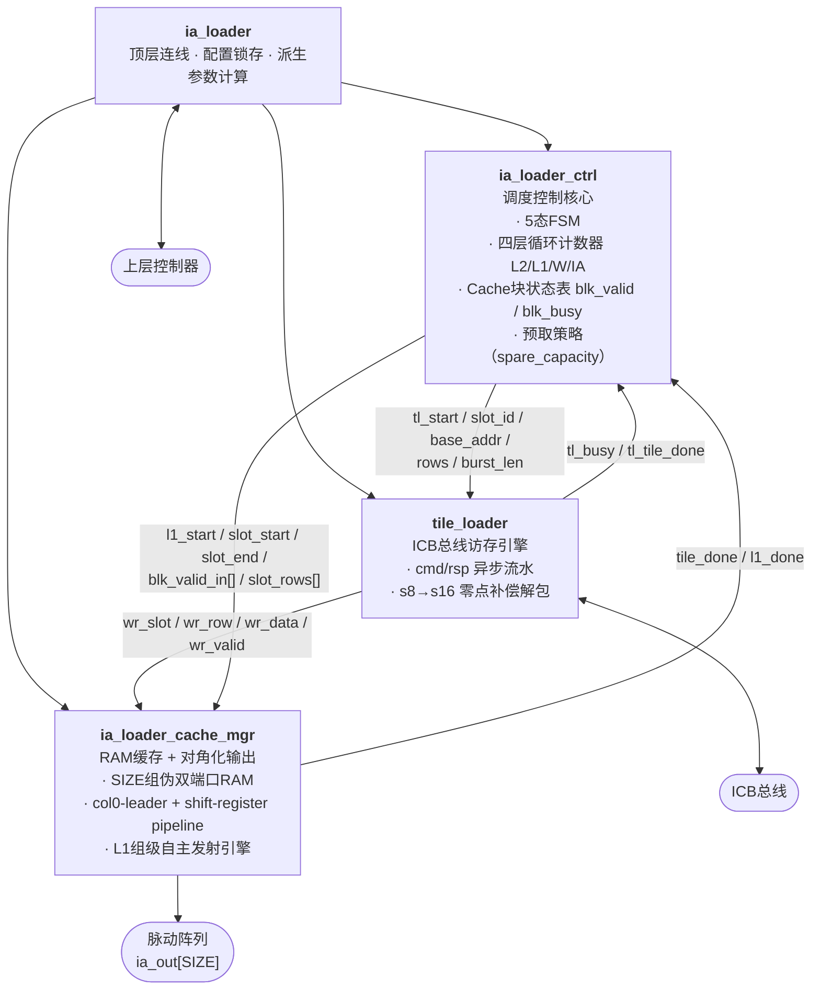
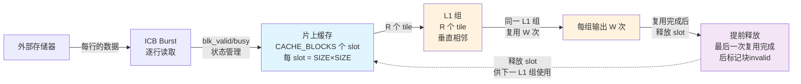
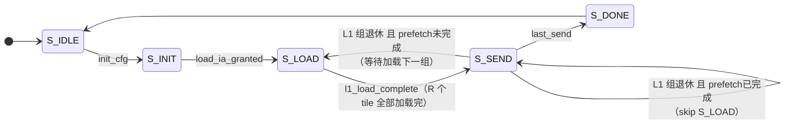

# ia_loader 模块 PPT 精华总结（v2.1）

---

## 一、模块定位

> **ia_loader** 自主从外部存储器读取输入激活（IA）分块矩阵，通过内部多槽缓存实现 L1/L2 两级数据复用，并以**对角化（Diagonal Skewing）方式**连续输出到 Weight-Stationary 脉动阵列。

---

## 二、模块层级结构



---

## 三、关键参数

| 参数 | 含义 | 典型值 |
|---|---|---|
| `SIZE` | 脉动阵列边长（行/列 Tile 大小） | 8 |
| `DATA_WIDTH` | 数据位宽（s16） | 16 |
| `BUS_WIDTH` | ICB 总线宽度（位） | 32 |
| `CACHE_BLOCKS` | 片上 RAM 槽位数，须 ≥ 2×R（R为 `ia_reuse_num`） | 4 |
| `R`（`ia_reuse_num`） | L1 一级组垂直深度（Tile 数） | 2 |
| `W`（`w_reuse_num`） | L2 二级组 W 轴复用次数 | \— |

---

## 四、顶层端口信号（精简）

### 控制握手

| 信号 | 方向 | 说明 |
|---|---|---|
| `init_cfg` | In | 单拍脉冲，锁存配置，启动新一轮 GEMM |
| `load_ia_req` / `load_ia_granted` | Out / In | ICB 总线授权握手 |
| `send_ia_trigger` | In | 触发当前已缓存 L1 组发送 |
| `ia_data_valid` | Out | 高：L1 组首 slot 就绪，可接受 trigger |
| `ia_sending_done` | Out | 单拍脉冲，**整个 L1 组**全部输出完成 |

### ICB 总线（Master）

| 信号 | 方向 | 说明 |
|---|---|---|
| `icb_cmd_valid/ready/addr/len` | Out/In | 读命令通道（只读，Burst） |
| `icb_rsp_valid/ready/rdata` | In/Out | 读响应通道 |

### 输出到脉动阵列

| 信号 | 方向 | 说明 |
|---|---|---|
| `ia_out[SIZE]` | Out | 各列输出数据，`ia_out[j]` 较 col0 延迟 j 拍 |
| `ia_row_valid` | Out | **标量**，对齐至最后一列（col SIZE-1）有效 |
| `ia_is_init_data` | Out | 当前 L1 组为累加序列首组时持续为高 |
| `ia_calc_done` | Out | 当前 L1 组为 L2 组末尾时持续为高 |

---

## 五、核心设计机制

### 5.1 两级复用结构



### 5.2 col0-leader + shift-register 对角化输出

```
col0 连续发射行地址（跨 tile 零间隔）：
  拍:    0     1     2     3     4     5     6     7
col0: T0R0  T0R1  T0R2  T1R0  T1R1  T1R2
col1:  ─    T0R0  T0R1  T0R2  T1R0  T1R1  T1R2
col2:  ─     ─    T0R0  T0R1  T0R2  T1R0  T1R1  T1R2
col3:  ─     ─     ─    T0R0  T0R1  T0R2  T1R0  T1R1  T1R2

总拍数 = Σvrows_i + SIZE - 1
```

- v2.0：每个 tile 独立 `diag_step` 计数器，tile 间有间隔
- **v2.1：shift-register `rd_en_pipe[j]=rd_en_pipe[j-1]`，col0 直接驱动，天然对角化，tile 间零间隔**

### 5.3 预取策略（v2.1 新增 spare_capacity）

```
spare_capacity = (r_cur + next_r_cur ≤ CACHE_BLOCKS)

情形 A：spare_capacity = true（如 R=2, CACHE_BLOCKS=4）
  进入 S_SEND 第一拍 → prefetch_active=1 → 立即后台加载下一 L1 组
  前一组L1退休时下一组L1预取已完成 → FSM skip S_LOAD，直接 S_SEND → S_SEND

情形 B：spare_capacity = false（缓冲区紧张）
  等到最后一轮（w_cnt == w_cur-1）才触发预取（兜底模式）
```

---

## 六、模块控制流设计

**ia_loader_ctrl** 是控制核心，负责三大职能：

1. **加载-发送协调**：缓冲区管理与预取控制，实现 Load-Send 重叠
2. **块状态管理**：维护 `blk_valid / blk_busy`表，Tile 输出后立即释放供复用
3. **层级循环调度**：驱动 L2/L1/W/IA 四层循环

---

## 七、ia_loader_ctrl 状态机



| 状态 | 主要行为 |
|---|---|
| `S_IDLE` | 等待 `init_cfg` |
| `S_INIT` | 计数器清零，请求总线授权 |
| `S_LOAD` | tile_loader 逐 tile 加载；首 tile 就绪即可触发发送（`ia_data_valid`） |
| `S_SEND` | cache_mgr 输出 L1 组；后台按 `spare_capacity` 预取下一组 |
| `S_DONE` | 拉高 `all_done` 一拍，返回 IDLE |

---

## 七、关键指标一览

| 指标 | 说明 |
|---|---|
| **带宽复用倍数** | `W` 倍（L1 组复用）× `G1` 组轮转（L2 组），IA 侧外存带宽降至 `1/W` |
| **L1 组发送时长** | `Σvrows_i + SIZE - 1` 拍（含对角化拖尾） |
| **预取效率** | `spare_capacity` 成立时，W 轴全程后台加载，L1 组切换零等待 |
| **数据格式** | 外存 s8（可选 s16），片上统一 s16（含零点补偿） |
| **容量约束** | `CACHE_BLOCKS ≥ 2 × ia_reuse_num`；`R ∈ {1,2,3,4}`、`W ∈ {1,2,3,4}` |

---

## 八、关键 Feature 总结

### ✓ Feature 1：L1 组级语义的 `ia_sending_done`
- **设计**：`ia_sending_done` 仅在整个 **L1 组最后一个 Tile 输出完成** 时才拉高一拍
- **价值**：使上层控制器明确感知 L1 组级计算边界，而非 Tile 粒度，便于后级流水线管理
- **验证**：预定义 `exact_2x2`, `large_r`, `large_w` 核心场景全部通过

### ✓ Feature 2：零间隔对角化输出（col0-leader + shift-register）
- **设计**：col0 通过 `col_valid_fifo` 连续驱动行读使能，其余列通过 `rd_en_pipe[j]=rd_en_pipe[j-1]` 自然对角化
- **优化**：相对 v2.0 逐列计数器方案，**消除 Tile 间间隔**，显著提升吞吐
- **效果**：L1 组发送时长 = `Σvrows_i + SIZE - 1`（最优化，无多余暂停周期）

### ✓ Feature 3：缓冲感知预取（`spare_capacity`）
- **设计**：动态监测缓冲区余量 `r_cur + next_r_cur ≤ CACHE_BLOCKS`
  - 有余量时：进入 S_SEND 第 1 拍立即启动预取，L1 组切换零等待（skip S_LOAD）
  - 无余量时：保守延迟至最后一轮复用，待释放后再加载
- **价值**：最大化 Load-Send 重叠率，减少闲置周期
- **覆盖**：`max_reuse`、`large_w` 等强复用场景验证

### ✓ Feature 4：s8/s16 原生双路径支持
- **设计**：`use_16bits` 参数控制全链路数据格式
  - s16 路径：固定点运算，精度足
  - s8 路径：符号扩展至 s16，LHS 零点链路同步补偿
- **价值**：在低精度任务中节省外存带宽自 50%（s8 vs s16），保持功能正确性
- **验证**：18 个预定义 case + 20 个随机 case，s8/s16 双覆盖全通过

### ✓ Feature 5：灵活的两级复用与早期释放
- **设计**：支持 `R ∈ {1,2,3,4}` 和 `W ∈ {1,2,3,4}` 的自由组合，块状态表 `blk_valid` 在最后一次复用后即标记可复用
- **适配**：无复用（R=1,W=1） → 中浅复用（R=2,3） → 深 L1 组（R=4） → 强 Weight 复用（W=4），覆盖全量 GEMM 形态
- **余量**：缓冲简洁，不浪费额外 SRAM

### ✓ Feature 6：参数配置高灵活性
- **设计**：`ia_reuse_num`(R)、`w_reuse_num`(W)、`k`、`n`、`m` 等均为运行时配置，通过 `init_cfg` 脉冲锁存，支持动态切换不同 GEMM 形态
- **约束**：`R ∈ {1,2,3,4}`、`W ∈ {1,2,3,4}`；`CACHE_BLOCKS ≥ 2×R`；`k/n/m ≤ 2^(REG_WIDTH-1)-1`
- **价值**：同一硬件可适配图像卷积、矩阵乘法、深度模型推理等多样化网络层，无需重新综合
- **应用**：根据网络 GEMM 维度动态调整 R/W，平衡缓存占用与重叠效率；零点偏移 `lhs_zp` 独立配置，支持 requant 流程

---

## 九、v2.1 改进点汇总

| 改进项 | v2.0 → v2.1 |
|---|---|
| **对角化机制** | 逐列独立计数 → col0-leader + shift-register 管道（zero gap） |
| **完成语义** | Tile 粒度 `tile_done` → **L1 组粒度 `ia_sending_done`** |
| **预取策略** | 静态"最后一轮" → 动态 `spare_capacity` 感知（重叠率提升） |
| **验证覆盖** | 16 个定向 case → **18 个 + 随机回归**（s8/s16 双路径） |
| **吞吐** | ~SIZE 拍/Tile → **无多余间隔**（最优连续输出） |
