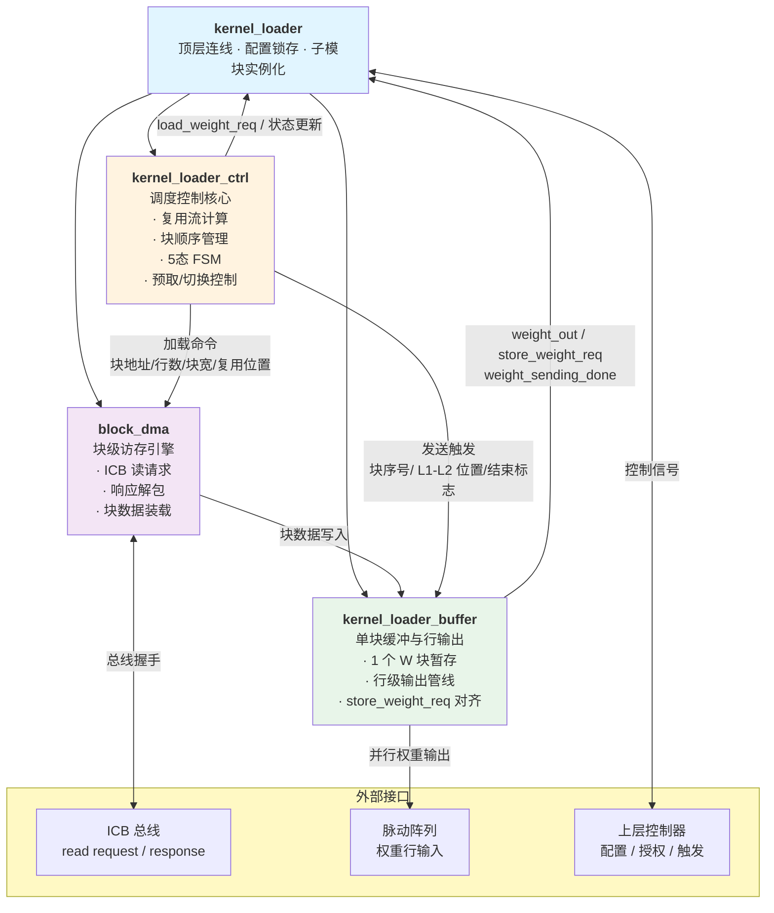
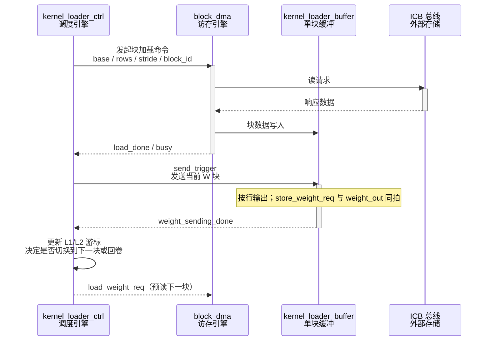
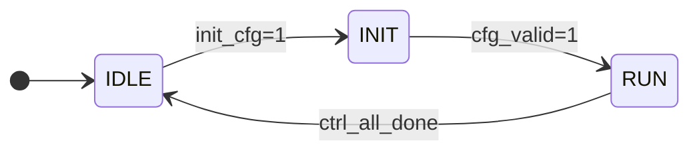
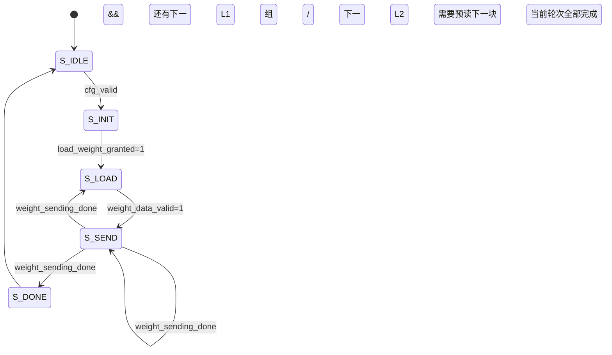

# `kernel_loader` 设计文档

> **版本**：v1.0  
> **更新日期**：2026-04-09  
> **参考文档**：《ia_loader_enhanced_design.md》《DSA模块设计文档.md》

---

## 版本变更记录

| 版本 | 主要变化 |
|---|---|
| v1.0 | 新版 kernel loader 文档；拆分为 `ctrl` + `buffer`；顶层实例化 `block_dma`；支持基于 `ia_reuse_num` / `w_reuse_num` 的 W 分块复用流 |

---

## 0. 模块概述

`kernel_loader` 负责从外部存储器读取权重矩阵（W / RHS），按块加载到内部缓冲，并在脉动阵列需要时按行输出权重数据。与旧版“单体式权重加载器”相比，新版采用与 `ia_loader` 对齐的分层设计：

- 顶层只负责配置锁存、子模块实例化、端口汇聚和总线接入。
- `kernel_loader_ctrl` 负责复用流调度、块顺序计算、状态切换和预取请求。
- `kernel_loader_buffer` 只暂存一个 W 块，负责块内数据保存、行级输出和输出完成握手。
- `block_dma` 负责具体的块级访存事务，包括 ICB 请求、响应接收和数据装载。

本模块的核心特征有三点：

1. **单块缓冲**：buffer 中一次只保存一个 W 块，不维护多槽缓存表。
2. **复用调度**：kernel_loader 通过 `ia_reuse_num` 和 `w_reuse_num` 决定 W 块在 IA L1 组窗口中的重复输出顺序。
3. **块级完成脉冲**：`weight_sending_done` 表示当前 W 块的整段输出完成，随后模块即可申请预读下一个 W 块。

---

## 1. 模块层级与架构设计

### 1.1 模块层级图



### 1.2 各子模块职责分工

| 子模块 | 核心职责 | 关键内部状态 |
|---|---|---|
| `kernel_loader` | 顶层状态管理；`init_cfg` 触发配置锁存；实例化 `ctrl`、`buffer`、`block_dma` | 3 态 FSM；配置寄存器；派生参数寄存器 |
| `kernel_loader_ctrl` | 根据 `ia_reuse_num` / `w_reuse_num` 生成 W 块输出顺序；维护 L1/L2 复用游标；管理加载与发送切换 | 5 态 FSM；`l1_idx`；`l2_idx`；`block_idx`；`send_phase`；`load_phase` |
| `kernel_loader_buffer` | 单块暂存；块内行级输出；与 `store_weight_req` 同步驱动阵列锁存 | `buf_valid`；`buf_busy`；`send_row_idx`；`row_valid` |
| `block_dma` | 以 ICB Master 身份执行块级读事务；按地址和行/列跨度读取 W 块；将数据写入 buffer | `active`；`cmd_row_cnt`；`rsp_row_cnt`；`rsp_beat_cnt` |

### 1.3 模块间交互流程



---

## 2. 参数定义

| 参数 | 默认值 | 描述 |
|---|---|---|
| `DATA_WIDTH` | `8` | 单个权重元素位宽；通常为 s8，输出到阵列前可按实现需要扩展或重排 |
| `SIZE` | `16` | 脉动阵列行/列宽度；每个 W 块的单行输出宽度 |
| `BUS_WIDTH` | `32` | ICB 总线数据宽度 |
| `REG_WIDTH` | `32` | 配置寄存器宽度 |
| `CACHE_BLOCKS` | `1` | 缓冲块数；新版 kernel_loader 仅暂存一个 W 块 |

> 注：`CACHE_BLOCKS` 在新版设计中语义固定为 1，表示 buffer 只保留一个完整 W 块，不维护 IA loader 那样的多槽缓存表。

---

## 3. 接口定义

### 3.1 时钟与复位

| 信号 | 方向 | 位宽 | 描述 |
|---|---|---|---|
| `clk` | In | 1 | 系统时钟，上升沿有效 |
| `rst_n` | In | 1 | 异步低有效复位 |

### 3.2 配置与控制接口

| 信号 | 方向 | 位宽 | 描述 |
|---|---|---|---|
| `init_cfg` | In | 1 | 单拍脉冲，触发配置锁存与派生参数计算 |
| `load_weight_req` | Out | 1 | 模块向外部控制器申请下一次 W 块访存授权 |
| `load_weight_granted` | In | 1 | 外部控制器授权块级访存 |
| `send_weight_trigger` | In | 1 | 单拍脉冲，触发当前已缓存 W 块开始逐行发送 |

### 3.3 矩阵尺寸与复用配置

| 信号 | 方向 | 位宽 | 描述 |
|---|---|---|---|
| `k` | In | `REG_WIDTH` | IA 矩阵行数；用于与 IA 侧复用窗口对齐 |
| `n` | In | `REG_WIDTH` | IA 矩阵列数；用于计算 weight 相关的分块边界 |
| `m` | In | `REG_WIDTH` | 输出矩阵列数；决定 W 方向的循环次数 |
| `rhs_base` | In | `REG_WIDTH` | 权重矩阵起始字节地址 |
| `rhs_row_stride_b` | In | `REG_WIDTH` | 权重矩阵行步幅（字节） |
| `rhs_zp` | In | signed `REG_WIDTH` | 权重零点或偏移量 |
| `ia_reuse_num` | In | `REG_WIDTH` | IA 侧 L1 组的复用深度；kernel_loader 依据它决定 W 块需要循环回放的次数 |
| `w_reuse_num` | In | `REG_WIDTH` | W 侧单个 L1 组中包含的块数 |

### 3.4 ICB 主接口

#### 命令通道

| 信号 | 方向 | 位宽 | 描述 |
|---|---|---|---|
| `icb_cmd_valid` | Out | 1 | 命令有效 |
| `icb_cmd_ready` | In | 1 | 从端就绪 |
| `icb_cmd_read` | Out | 1 | 固定为 1，表示只读 |
| `icb_cmd_addr` | Out | `REG_WIDTH` | 读起始字节地址 |
| `icb_cmd_len` | Out | 4 | Burst 长度减一 |

#### 响应通道

| 信号 | 方向 | 位宽 | 描述 |
|---|---|---|---|
| `icb_rsp_valid` | In | 1 | 响应数据有效 |
| `icb_rsp_ready` | Out | 1 | 模块准备接收响应 |
| `icb_rsp_rdata` | In | `BUS_WIDTH` | 读取数据 |
| `icb_rsp_err` | In | 1 | 总线错误标志 |

### 3.5 输出到脉动阵列

| 信号 | 方向 | 位宽 | 描述 |
|---|---|---|---|
| `weight_out[SIZE]` | Out | `signed [DATA_WIDTH-1:0]` | 当前周期输出的权重行；每列对应一个 PE 输入 |
| `store_weight_req` | Out | 1 | 与 `weight_out` 同拍有效，表示阵列应在本周期锁存权重 |
| `weight_sending_done` | Out | 1 | 当前 W 块全部输出完成时拉高一拍 |
| `weight_data_valid` | Out | 1 | 当前 W 块已经装载到 buffer，且允许进入发送阶段 |

---

## 4. 功能描述

### 4.1 访存与输出的基本语义

`kernel_loader` 以“块”为最小访存单位，以“行”为最小输出单位。

- `block_dma` 负责把一个完整 W 块读入 `kernel_loader_buffer`。
- `kernel_loader_buffer` 在发送期间逐行驱动 `weight_out[SIZE]` 和 `store_weight_req`。
- 当一个 W 块的最后一行被送出后，`weight_sending_done` 拉高一拍。
- `ctrl` 在收到 `weight_sending_done` 后推进块游标，并决定是继续同一 L2 组，切换到下一 L2 组，还是回到第一组开始新一轮循环。

### 4.2 W 分块的 L1 / L2 组织方式

新版 kernel_loader 与 IA loader 采用对偶的分组方式，但方向相反：

- IA loader 的 L1 组沿 IA 垂直方向组织。
- kernel_loader 的 L1 组沿 W 的**行方向**组织。
- IA loader 的 L2 组沿 IA 水平方向组织。
- kernel_loader 的 L2 组沿 W 的**列方向**组织。

#### 4.2.1 术语定义

| 符号 | 含义 |
|---|---|
| `W_RTN` | W 矩阵按块后的行方向块数 |
| `W_CTN` | W 矩阵按块后的列方向块数 |
| `R` | `ia_reuse_num`，表示 IA 侧一个复用窗口需要重复消费 W 流的次数 |
| `W` | `w_reuse_num`，表示 W 侧每个 L1 组包含的块数 |
| `W_act` | `w_reuse_num_act`，最后一个 L1 组的实际有效块数 |
| `G2` | W 的 L2 组总数 |
| `G1` | 每个 L2 组内的 L1 组数 |

#### 4.2.2 分组示例

以 4×4 个块的矩阵为例，块编号如下：

```text
1   2   3   4
5   6   7   8
9  10  11  12
13 14  15  16
```

当 `w_reuse_num_act = 2` 时，L1 组在行方向上按“左到右”输出，L2 组在列方向上按“从左列组到右列组”切换：

| L2 组 | 输出顺序 |
|---|---|
| L2-0 | `1, 2, 5, 6, 9, 10, 13, 14` |
| L2-1 | `3, 4, 7, 8, 11, 12, 15, 16` |

其中：

- 每个 L1 组包含 `w_reuse_num_act` 个连续块。
- 每个 L2 组覆盖一整列块带，输出时先完成该列带内所有 L1 组，再切到下一列带。
- 当最后一个 L2 组输出完成后，是否回卷到第一个 L2 组，由矩阵尺寸推导出的总 L2 轮次和 `ia_reuse_num` 共同决定，不由 IA 侧的即时请求直接驱动。

#### 4.2.3 输出顺序的控制原则

输出顺序遵循以下规则：

1. 先固定当前 L2 组。
2. 在该 L2 组内，从上到下遍历每一行对应的 L1 组。
3. 对于每个 L1 组，按 `w_reuse_num_act` 个块从左往右输出。
4. 当前 L2 组结束后，切换到下一个 L2 组。
5. 当前所有 L2 组结束后，若由矩阵尺寸和 `ia_reuse_num` 计算出的回卷轮次尚未完成，则回到第一个 L2 组开始下一轮。

### 4.3 复用流与 IA L1 组的关系

kernel_loader 的复用控制不是独立孤立的，而是由 IA 的 L1 组输出窗口驱动：

- 当 IA 正在输出一个 L1 组时，W 块保持驻留在阵列中。
- 当前 W 块输出完毕后，kernel_loader 立即申请预读下一个 W 块。
- 是否需要回卷到第一个 L2 组，取决于当前已完成的轮次，以及 `ia_reuse_num` 与矩阵尺寸共同决定的总轮数。

换句话说，`ia_reuse_num` 决定“IA 侧还会把当前 W 流重复消费多少次”，`w_reuse_num` 决定“每次消费里 W 块如何分成 L1 组”。

### 4.4 单块 buffer 的行为

新版 buffer 只暂存一个完整 W 块，因此它的行为更接近“单块弹仓”而不是“多槽缓存”：

| 状态 | 含义 |
|---|---|
| EMPTY | 当前没有可发送的 W 块 |
| FULL | 一个完整 W 块已经装载完成，可进入发送 |
| SENDING | 当前 W 块正在逐行输出 |

由于只有一个块，buffer 内不需要 IA loader 那样的 `valid/busy` 多位表；但仍然需要保证装载与发送的互斥：

- 发送时禁止覆盖当前块。
- 当前块发送完成后才能接受下一块写入。
- 若外部授权提前到来，`block_dma` 仅能在 buffer 释放后真正开始装载下一块。

### 4.5 `store_weight_req` 的时序含义

`store_weight_req` 是阵列侧的权重锁存使能信号，和 `weight_out[SIZE]` 同拍有效。

- 在当前 W 块的每个有效输出周期，`store_weight_req` 为 1。
- 阵列应在该周期锁存 `weight_out`。
- 当前 W 块最后一行输出完成时，`weight_sending_done` 拉高一拍。

也就是说：

- `store_weight_req` 负责“行级锁存”。
- `weight_sending_done` 负责“块级收尾”。

### 4.6 `load_weight_req` 的时序含义

`load_weight_req` 是模块向外部控制器发出的下一次访存申请。

- 当前 W 块发送完成后，`load_weight_req` 可以立即拉高。
- 外部控制器给出 `load_weight_granted` 后，`block_dma` 才开始下一块加载。
- 因为 buffer 只有一个块，所以默认不做“发送与加载同块重叠”，而是采用块与块之间的顺序切换。

---

## 5. 状态机设计

### 5.1 顶层 FSM

顶层 `kernel_loader` 只做最小状态管理：



### 5.2 控制核心 FSM

`kernel_loader_ctrl` 负责全局调度：



#### 5.2.1 状态职责

| 状态 | 主要职责 | 关键输出 |
|---|---|---|
| `S_IDLE` | 等待 `init_cfg` | 无 |
| `S_INIT` | 锁存派生参数；初始化块游标与复用计数 | `load_weight_req=1` |
| `S_LOAD` | 驱动 `block_dma` 读取当前 W 块 | `dma_start` |
| `S_SEND` | 驱动 `buffer` 输出当前 W 块；在块尾更新复用游标 | `send_weight_trigger` |
| `S_DONE` | 一轮完整复用结束，拉高完成指示一拍 | `all_done=1` |

#### 5.2.2 复用游标

ctrl 内部建议维护以下游标：

| 游标 | 作用 |
|---|---|
| `l1_idx` | 当前 L1 组索引，控制同一列带内的块输出进度 |
| `l2_idx` | 当前 L2 组索引，控制列带切换 |
| `block_idx` | 当前 W 块的全局编号 |
| `repeat_idx` | 当前 W 流对应的 IA 复用轮次 |

控制器每次收到 `weight_sending_done`，就根据这四个游标决定下一步：

1. 当前 L1 组还有块未发完，则进入下一个块。
2. 当前 L1 组已结束但 L2 组未结束，则切换到下一行的 L1 组。
3. 当前 L2 组已结束但还有复用轮次，则回卷到第一个 L2 组。
4. 全部轮次结束，则进入 `S_DONE`。

---

## 6. 子模块设计详解

### 6.1 `kernel_loader` 顶层连线模块

**设计目标**：顶层只保留“外部契约”，不承载复杂调度逻辑。

主要任务：

1. 锁存 `init_cfg` 时的原始配置。
2. 计算块数量、L1/L2 组数和回卷轮次。
3. 实例化 `kernel_loader_ctrl`、`kernel_loader_buffer` 和 `block_dma`。
4. 汇聚外部接口并对外输出 `store_weight_req` / `weight_out` / `weight_sending_done`。

### 6.2 `kernel_loader_ctrl` 调度控制核心

**设计目标**：把所有复用策略集中到一个模块中，避免把调度逻辑散落在访存和输出模块里。

#### 6.2.1 核心职责

- 计算当前 W 块所属的 L1 / L2 位置。
- 决定下一块是“同组继续”、“切组”还是“回卷”。
- 管理 `load_weight_req` 和 `send_weight_trigger` 的时序。
- 监听 `weight_sending_done` 并推进块游标。

#### 6.2.2 预读策略

由于 buffer 只存一个块，预读策略是严格顺序式的：

1. 当前块发送完成。
2. ctrl 发出 `load_weight_req`。
3. 外部控制器授权后，`block_dma` 读取下一块。
4. buffer 装载完成后，`weight_data_valid` 置高。
5. 外部再发 `send_weight_trigger` 启动下一块输出。

这种策略简单、稳定，且不会引入多块缓存竞争。

### 6.3 `kernel_loader_buffer` 单块缓冲模块

**设计目标**：只负责“存一块”和“吐一块”，不参与地址计算和复用决策。

#### 6.3.1 内部结构

| 结构 | 说明 |
|---|---|
| `buf_mem` | 暂存一个完整 W 块的 RAM / 寄存器阵列 |
| `row_idx` | 当前输出到第几行 |
| `buf_valid` | 当前块已装载完成 |
| `buf_busy` | 当前块正在输出 |
| `row_valid` | 当前输出行有效 |

#### 6.3.2 输出行为

- 当 `send_weight_trigger` 到来时，如果 `buf_valid=1`，buffer 进入发送态。
- 发送期间每拍输出一行 `weight_out[SIZE]`。
- 每拍同步拉高 `store_weight_req`。
- 最后一行输出完成时，`weight_sending_done` 拉高一拍并释放 `buf_busy`。

### 6.4 `block_dma` 块级访存引擎

**设计目标**：把外部总线事务封装成“输入一个块命令，输出一个完整块数据”的自包含单元。

#### 6.4.1 输入参数

- `block_base_addr`：当前 W 块的起始地址。
- `block_rows`：当前 W 块需要读取的行数。
- `block_cols`：当前 W 块的块宽。
- `row_stride_b`：行步幅。
- `rhs_zp`：权重零点或偏移。

#### 6.4.2 内部处理流程

```text
start
  -> 锁存块参数
  -> 逐行发出 ICB 读请求
  -> 接收响应并解包/重排
  -> 写入 buffer
  -> 完成后拉高 load_done
```

#### 6.4.3 错误处理

若 `icb_rsp_err` 为高，`block_dma` 应立即向 ctrl 上报错误，并停止当前块装载，等待上层清理或重试。

---

## 7. 关键参数预计算一览

以下参数建议在 `init_cfg` 时一次性计算并锁存：

| 寄存器 | 计算式 | 说明 |
|---|---|---|
| `w_row_tile_num` | `ceil(n / SIZE)` | W 矩阵按块后的行方向块数 |
| `w_col_tile_num` | `ceil(m / SIZE)` | W 矩阵按块后的列方向块数 |
| `l2_group_num` | `ceil(w_col_tile_num / w_reuse_num)` | L2 组总数 |
| `l1_per_l2` | `w_row_tile_num` | 每个 L2 组内的 L1 组数 |
| `w_reuse_num_act` | 最后一个 L1 组的实际有效块数 | 处理尾组不足 `w_reuse_num` 的情况 |
| `repeat_num` | 由 `ia_reuse_num` 与 IA 侧窗口共同决定 | 当前 W 流需要回卷的次数 |

> 如果 `w_reuse_num` 取 2 的幂次，则尾组余数可用低位掩码简化；否则在 `init_cfg` 阶段完成一次性比较即可。

---

## 8. 典型工作时序示例

以 4×4 个块、`w_reuse_num=2`、`ia_reuse_num=2` 为例：

```text
Cycle 0  : init_cfg=1，锁存参数
Cycle 1  : ctrl 进入 S_INIT，发出 load_weight_req
Cycle 2  : 授权到达，block_dma 开始加载 L2-0 / L1-0 的 W 块
Cycle 3  : buffer 装载完成，weight_data_valid=1
Cycle 4  : send_weight_trigger=1，开始输出当前 W 块
Cycle 5+ : store_weight_req 拉高，weight_out 逐行送入阵列
最后一行 : weight_sending_done=1
下一拍   : ctrl 更新游标并申请下一块加载
```

对于块序列，输出顺序为：

- 第一轮 L2-0：`1, 2, 5, 6, 9, 10, 13, 14`
- 第二轮 L2-1：`3, 4, 7, 8, 11, 12, 15, 16`
- 若 IA 复用窗口要求继续，则回到 L2-0 重新输出

---

## 9. 注意事项与实现约束

1. **单块缓冲约束**：buffer 只允许保存一个完整 W 块，不能同时容纳两个块。
2. **顺序授权约束**：`load_weight_req` 与 `send_weight_trigger` 必须按块边界切换，不要在同一块未完成时重复触发加载。
3. **输出同步约束**：`store_weight_req` 必须与 `weight_out` 同拍有效，不能提前或延后。
4. **完成脉冲语义**：`weight_sending_done` 只表示“当前 W 块发送完成”，不是整轮 GEMM 完成。
5. **回卷约束**：当最后一个 L2 组结束后，是否回到第一个 L2 组，必须由 `ia_reuse_num` 和当前 IA 侧复用进度共同决定。
6. **错误处理**：ICB 响应错误必须上报 ctrl，禁止静默忽略。

---

## 10. 版本差异汇总

| 方面 | 旧版 kernel_loader | 新版 kernel_loader |
|---|---|---|
| 模块结构 | 单体式控制逻辑 | 顶层 + `ctrl` + `buffer` + `block_dma` |
| 缓冲策略 | 多状态混合管理 | 单块缓冲，只保存一个 W 块 |
| 复用控制 | 隐式或耦合在发送逻辑中 | 显式使用 `ia_reuse_num` / `w_reuse_num` |
| 输出粒度 | 块与行逻辑混杂 | 块级调度 + 行级输出分离 |
| 预取策略 | 直接串行 | 块完成后立即请求下一块 |
| 可测试性 | 较弱 | 子模块可分别做单元测试 |
