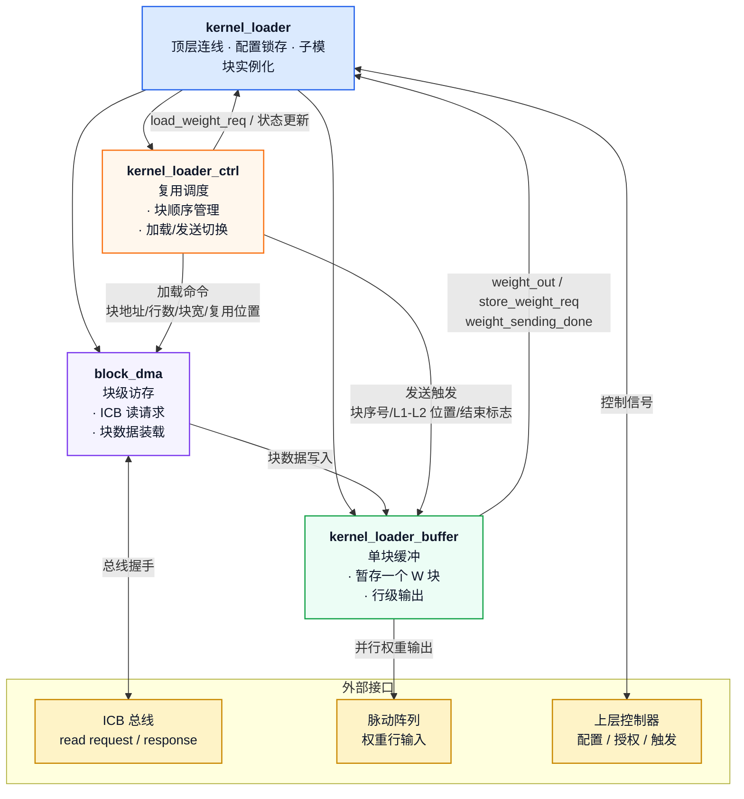
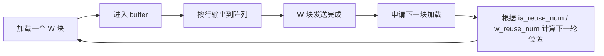
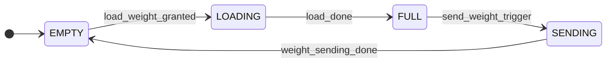

# `kernel_loader` 模块 PPT 精华总结

> 适用于汇报、评审和设计宣讲。内容按“模块定位 -> 架构 -> 端口 -> 关键机制 -> 验证结果”组织，可直接拆分成幻灯片页面。

---

## 1. 一句话定位

`kernel_loader` 是一个面向权重矩阵（W / RHS）的自主访存加载器：它从外部存储器按块读取权重，使用单块 buffer 暂存，并通过 `ia_reuse_num` / `w_reuse_num` 预计算 L1/L2 复用流与回卷轮次，最终按行输出到 Weight-Stationary 脉动阵列。

---

## 2. PPT 页面建议文案

### 页面 1：模块概述

- `kernel_loader` 负责权重矩阵的自主加载、缓存和逐行输出。
- 新版采用“顶层 + ctrl + buffer + block_dma”的分层设计。
- buffer 只保存一个 W 块，降低控制复杂度，便于验证。
- `weight_sending_done` 表示当前 W 块输出完成，可立即申请下一块。

### 页面 2：设计目标

- 对齐 `ia_loader` 的模块化风格和测试方法。
- 支持 `ia_reuse_num` / `w_reuse_num` 驱动的复用流。
- 支持边界 tile、零点偏移、非对齐基址和授权反压。
- 通过 Verilator + ICB bridge 完成完整回归验证。

### 页面 3：核心机制

- `kernel_loader_ctrl` 负责块顺序、L1/L2 轮转和加载/发送切换。
- `kernel_loader_buffer` 只做一块的暂存、行级输出和完成脉冲。
- `block_dma` 负责 ICB 读事务和块数据装载。
- `store_weight_req` 与 `weight_out` 同拍有效，阵列在该拍锁存权重。

### 页面 4：关键收益

- 单块缓冲降低缓存管理复杂度。
- 复用流显式化，提高调度透明度。
- 支持多样化边界 case，验证更完整。
- 测试链路采用 `icb_unalign_bridge + SRAM`，与系统总线行为一致。

### 页面 5：验证结果

- 定义了 13 个预定义 case，覆盖精确对齐、行余量、列余量、行列余量、零点偏移、非对齐基址和加载反压。
- 验证链路采用 `Verilator + icb_unalign_bridge + SRAM model`，可同时覆盖总线访问、块装载和 buffer 输出。
- `run_all` 已通过 13/13，随机回归默认 100 组，用于补充边界组合覆盖。
- 关键路径包括：块加载、buffer 暂存、逐行输出、复用回卷、单周期触发和 bridge 传输。

---

## 3. 模块层级图

---

## 4. 端口定义总览

### 4.1 控制端口

| 信号 | 方向 | 位宽 | 说明 |
|---|---|---|---|
| `init_cfg` | In | 1 | 单拍触发，锁存配置并进入新一轮运行 |
| `load_weight_req` | Out | 1 | 请求外部控制器授权，开始下一块加载 |
| `load_weight_granted` | In | 1 | 外部授权，可启动 `block_dma` |
| `send_weight_trigger` | In | 1 | 触发当前已缓存 W 块开始逐行发送 |

### 4.2 矩阵与复用配置

| 信号 | 方向 | 位宽 | 说明 |
|---|---|---|---|
| `k` | In | `REG_WIDTH` | 矩阵行数 |
| `n` | In | `REG_WIDTH` | 矩阵列数 |
| `m` | In | `REG_WIDTH` | 输出列数 |
| `rhs_base` | In | `REG_WIDTH` | 权重基地址 |
| `rhs_row_stride_b` | In | `REG_WIDTH` | 权重行步幅（字节） |
| `rhs_zp` | In | signed `REG_WIDTH` | 权重零点/偏移 |
| `ia_reuse_num` | In | `REG_WIDTH` | IA 侧复用轮数 |
| `w_reuse_num` | In | `REG_WIDTH` | W 侧 L1 组宽度 |

### 4.3 ICB 主接口

| 信号 | 方向 | 位宽 | 说明 |
|---|---|---|---|
| `icb_cmd_valid` | Out | 1 | 读命令有效 |
| `icb_cmd_ready` | In | 1 | 命令通道就绪 |
| `icb_cmd_read` | Out | 1 | 固定为只读 |
| `icb_cmd_addr` | Out | `REG_WIDTH` | 读起始地址 |
| `icb_cmd_len` | Out | 4 | Burst 长度减一 |
| `icb_rsp_valid` | In | 1 | 响应数据有效 |
| `icb_rsp_ready` | Out | 1 | 模块准备接收 |
| `icb_rsp_rdata` | In | `BUS_WIDTH` | 读数据 |
| `icb_rsp_err` | In | 1 | 响应错误标志 |

### 4.4 输出到脉动阵列

| 信号 | 方向 | 位宽 | 说明 |
|---|---|---|---|
| `weight_out[SIZE]` | Out | `signed [DATA_WIDTH-1:0]` | 并行行输出 |
| `store_weight_req` | Out | 1 | 与 `weight_out` 同拍有效 |
| `weight_sending_done` | Out | 1 | 当前 W 块发送完成脉冲 |
| `weight_data_valid` | Out | 1 | 当前 W 块已装载完成，可发送 |

---

## 5. 关键机制图

### 5.1 L1/L2 复用流

### 5.2 单块 buffer 行为

---

## 6. 验证与 Case 设计

### 6.1 Case 设计思路

- Case 按“从简单到边界、从确定性到随机”的顺序组织，便于逐步定位问题。
- 先覆盖精确对齐的基础路径，再加入行余量、列余量和双边余量，验证尾部 tile 的补零逻辑。
- 再加入 `rhs_zp` 偏移、非对齐基址和授权反压，验证数据修正、桥接读写和握手时序。
- 随机 case 以不同 `k / n / m / reuse / base_addr / rhs_zp` 组合补充组合型场景，帮助发现未显式枚举的边界。

### 6.2 覆盖总结

| Case 类别 | 代表案例 | 覆盖点 |
|---|---|---|
| 精确对齐 | `exact_1x1_r1_w1`、`exact_2x2_r1_w2`、`exact_4x4_r2_w2` | 基础加载和完整输出 |
| 行余量 | `row_rem_r1_w2` | 最后一行 tile 处理 |
| 列余量 | `col_rem_r1_w2` | 最后一列 tile 的无效列屏蔽 |
| 行列余量 | `both_rem_r2_w3` | 双边界综合验证 |
| 零点偏移 | `zp_offset_r1_w2` | `rhs_zp` 叠加路径 |
| 非对齐基址 | `unaligned_base_r1_w2` | bridge + SRAM 对齐路径 |
| 授权反压 | `grant_bp_r2_w2` | `load_weight_req / granted` 握手延迟 |

**结论**：`run_all` 已通过 13/13 个预定义 case。
通过随机回归补充了 100 组不同参数组合的测试，进一步验证了模块在多样化场景下的稳定性和正确性。

---

## 7. 可直接上 ppt 的结论页

- `kernel_loader` 采用模块化架构，职责清晰，便于综合与验证。
- 单块 buffer + block_dma 使权重加载逻辑更简单、更稳定。
- `ia_reuse_num` / `w_reuse_num` 显式决定复用流与回卷轮次，便于系统级调度。
- bridge + SRAM 的仿真链路已验证通过，边界与反压场景均覆盖。
