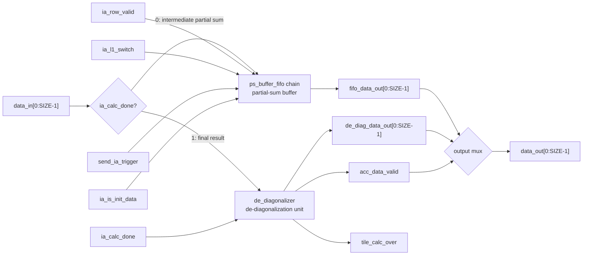
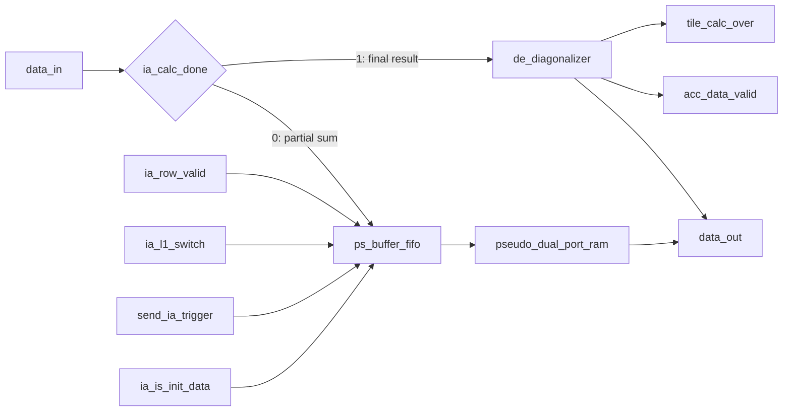
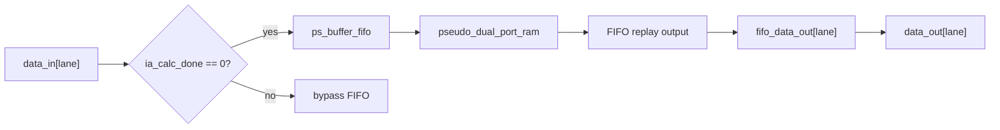
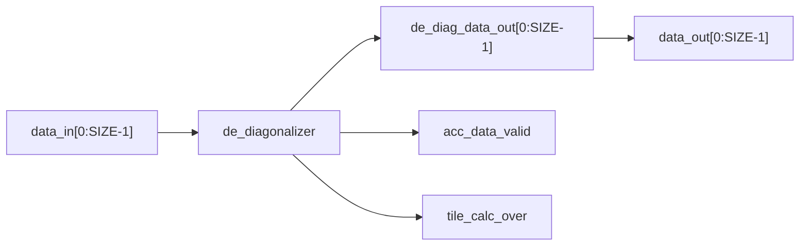
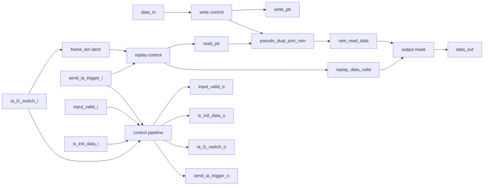
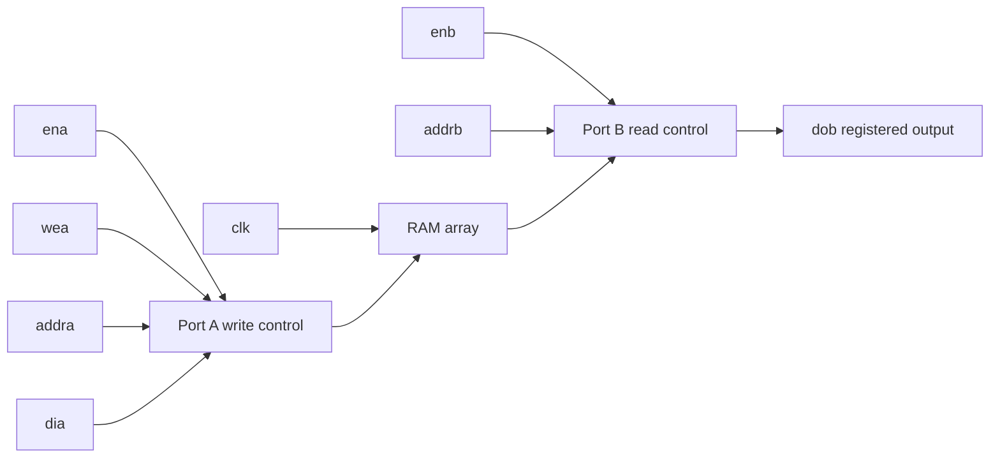
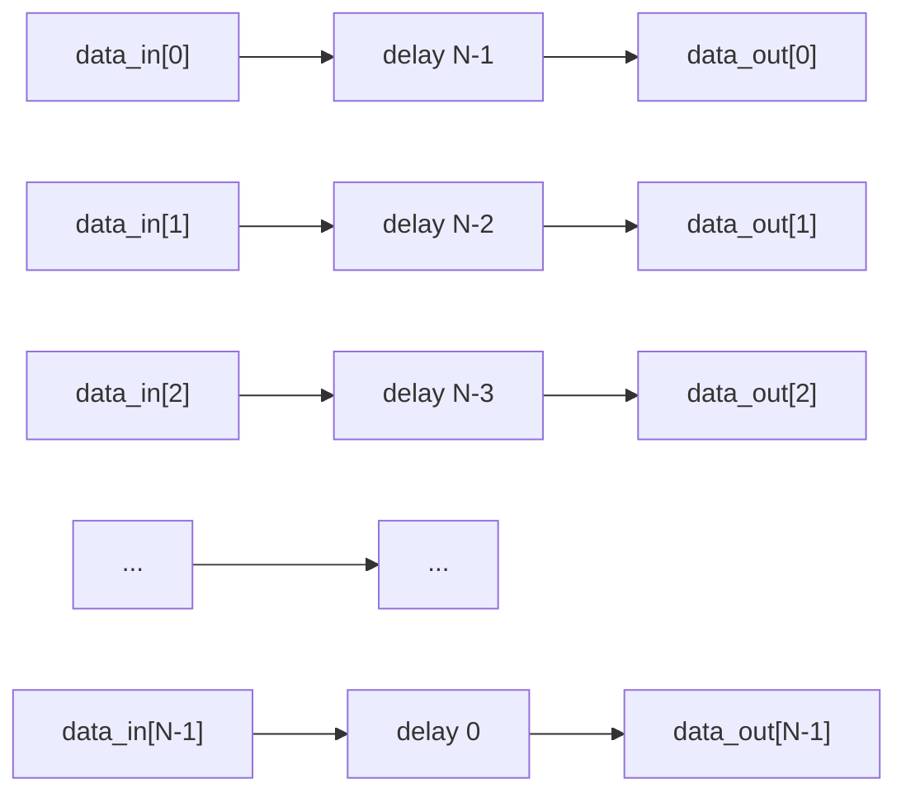
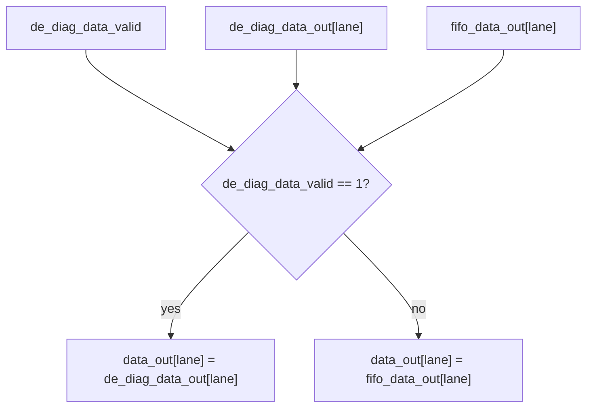
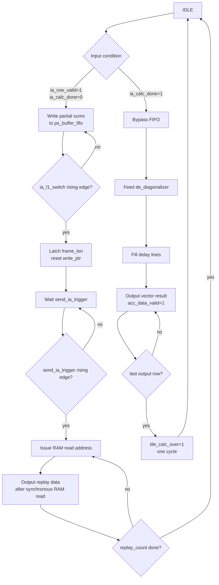

# `ps_buffer` 模块设计文档

<!-- markdownlint-disable MD060 -->

> **版本**：v2.0  
> **更新日期**：2026-04-26  
> **目标**：描述 `ps_buffer` 的标准数字电路实现：FIFO 部分和缓存、同步 RAM replay、`calc_done` 反对角化输出，以及 `pseudo_dual_port_ram` / `de_diagonalizer` 的时序语义。

---

## 1. 模块概述

`ps_buffer` 是 AI 加速器中用于处理部分和数据的缓存与结果整理模块，位于 systolic array / accumulator array 后级。

该模块主要完成两类功能：

1. **中间部分和缓存**

   * 接收阵列输出的对角化 / 阶梯化部分和数据；
   * 通过 `ps_buffer_fifo` 进行缓存；
   * 在后续阶段通过 `send_ia_trigger` 触发 replay；
   * replay 输出仍保持对角化 / 阶梯化格式。

2. **最终结果反对角化输出**

   * 当 `ia_calc_done` 有效时，输入数据不再进入 FIFO；
   * 数据进入 `de_diagonalizer`；
   * `de_diagonalizer` 将阶梯化数据重新整理为正常向量格式；
   * `acc_data_valid` 和 `tile_calc_over` 只由 `de_diagonalizer` 产生。

---

## 2. 顶层模块结构



### 2.1 简化版模块连接图



---

## 3. 子模块划分

| 子模块 | 功能 |
| --- | --- |
| `ps_buffer` | 顶层控制与数据路径选择 |
| `ps_buffer_fifo` | 单 lane 部分和缓存 FIFO |
| `pseudo_dual_port_ram` | FIFO 内部存储 RAM |
| `de_diagonalizer` | 反对角化模块，将阶梯化数据重新整理为向量输出 |

---

## 4. 顶层接口定义

### 4.1 参数定义

| 参数 | 说明 |
| --- | --- |
| `SIZE` | 输出向量 lane 数，同时对应阵列尺寸 |
| `DATA_WIDTH` | 单个数据元素位宽 |
| `DEPTH` | FIFO 深度，当前在 `ps_buffer` 中定义为 `SIZE * 4` |

### 4.2 输入信号

| 信号名 | 位宽 | 说明 |
| --- | ---: | --- |
| `clk` | 1 | 系统时钟 |
| `rst_n` | 1 | 低有效复位 |
| `data_in[0:SIZE-1]` | `SIZE * DATA_WIDTH` | 输入部分和数据 |
| `ia_row_valid` | 1 | 普通部分和输入有效 |
| `ia_calc_done` | 1 | 计算完成标志，同时作为反对角化输入有效 |
| `ia_l1_switch` | 1 | 当前 FIFO frame 写入结束 |
| `send_ia_trigger` | 1 | 触发 FIFO replay |
| `ia_is_init_data` | 1 | 标记当前数据是否为初始化数据 |

### 4.3 输出信号

| 信号名 | 位宽 | 说明 |
| --- | ---: | --- |
| `data_out[0:SIZE-1]` | `SIZE * DATA_WIDTH` | 输出数据，可能来自 FIFO 或反对角化模块 |
| `acc_data_valid` | 1 | 反对角化后的最终向量结果有效 |
| `tile_calc_over` | 1 | 当前 tile 最后一组最终向量结果输出完成 |

---

## 5. 数据路径说明

### 5.1 普通部分和缓存路径

当满足：

```systemverilog
ia_row_valid == 1'b1 && ia_calc_done == 1'b0
```

输入数据进入 `ps_buffer_fifo`。

在 `ps_buffer` 中，FIFO 写入 valid 的控制逻辑为：

```systemverilog
.input_valid_i(input_valid_chain[lane] & ~ia_calc_done)
```

因此，当 `ia_calc_done` 为高时，输入数据不会写入 FIFO。

普通部分和路径如下：



该路径输出的数据仍是 **对角化 / 阶梯化部分和**。

### 5.2 最终结果反对角化路径

当满足：

```systemverilog
ia_calc_done == 1'b1
```

输入数据进入 `de_diagonalizer`。



该路径用于输出最终计算结果。

---

## 6. `ps_buffer_fifo` 设计

### 6.1 模块功能

`ps_buffer_fifo` 是单 lane 的部分和缓存模块。

其功能包括：

1. 接收单 lane 输入数据；
2. 将数据写入内部 RAM；
3. 在 `ia_l1_switch_i` 到来时锁存当前 frame 长度；
4. 在 `send_ia_trigger_i` 到来后从 RAM 中 replay 数据；
5. 将控制信号向下一个 lane 传递。

需要注意：

```text
ps_buffer_fifo 不产生 acc_data_valid。
ps_buffer_fifo 不产生 tile_calc_over。
```

### 6.2 `ps_buffer_fifo` 内部结构



### 6.3 FIFO 写入逻辑

当：

```systemverilog
input_valid_i == 1'b1
```

时，数据写入 RAM。

RAM 写端口连接如下：

```systemverilog
assign ram_write_en   = input_valid_i;
assign ram_write_addr = write_ptr;
```

写入完成后，`write_ptr` 递增。

```systemverilog
if (input_valid_i) begin
    if (write_ptr != DEPTH_LAST_ADDR) begin
        write_ptr <= write_ptr + 1'b1;
    end
end
```

### 6.4 FIFO frame 长度锁存

当 `ia_l1_switch_i` 出现上升沿时，当前写入段结束，FIFO 锁存本次 frame 的长度。

```systemverilog
if (ia_l1_switch_i && !ia_l1_switch_i_d) begin
    if (input_valid_i) begin
        frame_len <= (write_ptr == DEPTH_LAST_ADDR) ?
                     DEPTH_COUNT : write_ptr_ext + 1'b1;
    end else begin
        frame_len <= write_ptr_ext;
    end

    write_ptr    <= '0;
    read_ptr     <= '0;
    replay_count <= '0;
end
```

其作用是：

```text
记录当前已经写入 RAM 的有效数据个数，
并为之后的 replay 提供读取长度。
```

### 6.5 FIFO replay 逻辑

当 `send_ia_trigger_i` 出现上升沿时，FIFO 开始 replay。

```systemverilog
if (send_ia_trigger_i && !send_ia_trigger_i_d) begin
    read_ptr     <= '0;
    replay_count <= frame_len;
end
```

之后每个周期读取一个 RAM 地址：

```systemverilog
assign ram_read_en   = (replay_count != '0);
assign ram_read_addr = read_ptr;
```

由于 RAM 是同步读，`dob` 会在读取地址发出后的时钟边沿更新。因此 FIFO 使用：

```systemverilog
replay_data_valid <= ram_read_en;
```

来对齐 RAM 输出。

最终输出：

```systemverilog
assign data_out = replay_data_valid ? ram_read_data : '0;
```

---

## 7. `pseudo_dual_port_ram` 设计

### 7.1 模块功能

`pseudo_dual_port_ram` 是伪双口 RAM：

| 端口 | 功能 |
| --- | --- |
| Port A | 同步写 |
| Port B | 同步读，输出寄存 |

接口如下：

```systemverilog
module pseudo_dual_port_ram #(
    parameter DATA_WIDTH = 8,
    parameter ADDR_WIDTH = 6
) (
    input  wire                  clk,
    input  wire                  ena,
    input  wire                  enb,
    input  wire                  wea,
    input  wire [ADDR_WIDTH-1:0] addra,
    input  wire [DATA_WIDTH-1:0] dia,
    input  wire [ADDR_WIDTH-1:0] addrb,
    output reg  [DATA_WIDTH-1:0] dob
);
```

### 7.2 RAM 结构图



### 7.3 RAM 时序特性

RAM 读写均发生在时钟上升沿。

```systemverilog
always @(posedge clk) begin
    if (ena && wea) begin
        ram[addra] <= dia;
    end

    if (enb) begin
        dob <= ram[addrb];
    end
end
```

因此：

```text
写入：ena && wea 有效时，在当前时钟边沿写入 ram[addra]。
读取：enb 有效时，在当前时钟边沿将 ram[addrb] 输出到 dob。
```

对于 FIFO 外部观察而言：

```text
send_ia_trigger 拉高后，下一拍开始看到第一个 replay 数据。
```

---

## 8. `de_diagonalizer` 设计

### 8.1 模块功能

`de_diagonalizer` 用于将 systolic array 输出的阶梯化数据重新整理为正常向量格式。

它本质上是一个 **三角形延时移位寄存器组**。

### 8.2 反对角化结构

对于 `SIZE=N`：

| lane | 延迟周期 |
| ---: | ---: |
| lane 0 | `N-1` |
| lane 1 | `N-2` |
| lane 2 | `N-3` |
| ... | ... |
| lane `N-1` | `0` |

结构如下：



### 8.3 `SIZE=4` 示例

输入阶梯化数据：

```text
cycle 0: [r0c0,   0,     0,     0]
cycle 1: [r1c0, r0c1,   0,     0]
cycle 2: [r2c0, r1c1, r0c2,   0]
cycle 3: [r3c0, r2c1, r1c2, r0c3]
cycle 4: [  0,  r3c1, r2c2, r1c3]
cycle 5: [  0,    0,  r3c2, r2c3]
cycle 6: [  0,    0,    0,  r3c3]
```

反对角化后输出：

```text
cycle 3: [r0c0, r0c1, r0c2, r0c3]
cycle 4: [r1c0, r1c1, r1c2, r1c3]
cycle 5: [r2c0, r2c1, r2c2, r2c3]
cycle 6: [r3c0, r3c1, r3c2, r3c3]
```

---

## 9. 顶层输出选择逻辑

`ps_buffer` 的 `data_out` 由输出 mux 选择。



等价逻辑为：

```systemverilog
always_comb begin
    for (int lane_idx = 0; lane_idx < SIZE; lane_idx++) begin
        if (de_diag_data_valid) begin
            data_out[lane_idx] = de_diag_data_out[lane_idx];
        end else begin
            data_out[lane_idx] = fifo_data_out[lane_idx];
        end
    end
end
```

因此：

```text
反对角化输出具有更高优先级。
```

---

## 10. 信号时序说明

### 10.1 普通部分和写入时序

```text
条件：
ia_row_valid = 1
ia_calc_done = 0
```

| Cycle | `ia_row_valid` | `ia_calc_done` | 动作 |
| ---: | ---: | ---: | --- |
| 0 | 1 | 0 | 写入 FIFO step0 |
| 1 | 1 | 0 | 写入 FIFO step1 |
| 2 | 1 | 0 | 写入 FIFO step2 |
| ... | 1 | 0 | 继续写入 FIFO |
| T | 1 | 0 | 写入当前 frame 最后一项 |

### 10.2 FIFO frame 切换时序

| Cycle | `ia_l1_switch` | 动作 |
| ---: | ---: | --- |
| T | 1 | 锁存当前 `frame_len` |
| T+1 | 0 | `write_ptr` 复位，准备下一段写入 |

### 10.3 FIFO replay 时序

由于 `pseudo_dual_port_ram` 为同步读，`send_ia_trigger` 后第一拍用于发起 RAM 读取，下一拍才输出第一个有效数据。

```text
假设 frame_len = K
```

| Cycle | `send_ia_trigger` | `ram_read_en` | `replay_data_valid` | `data_out` |
| ---: | ---: | ---: | ---: | --- |
| T | 1 | 0 | 0 | 0 |
| T+1 | 0 | 1 | 1 | step0 |
| T+2 | 0 | 1 | 1 | step1 |
| T+3 | 0 | 1 | 1 | step2 |
| ... | ... | 1 | 1 | ... |
| T+K | 0 | 0 | 0 | 0 |

在 FIFO replay 期间：

```text
acc_data_valid = 0
tile_calc_over = 0
```

因为这两个信号只由 `de_diagonalizer` 管理。

### 10.4 反对角化时序

设：

```text
SIZE = N
完整阶梯化输入长度 = 2N - 1
```

`ia_calc_done` 有效期间，输入数据进入 `de_diagonalizer`。

| Cycle | `ia_calc_done` | 输入数据 | `acc_data_valid` | `tile_calc_over` |
| ---: | ---: | --- | ---: | ---: |
| 0 | 1 | step0 | 0 | 0 |
| 1 | 1 | step1 | 0 | 0 |
| ... | 1 | ... | 0 | 0 |
| N-2 | 1 | step`N-2` | 0 | 0 |
| N-1 | 1 | step`N-1` | 1 | 0 |
| N | 1 | step`N` | 1 | 0 |
| ... | 1 | ... | 1 | 0 |
| 2N-2 | 1 | step`2N-2` | 1 | 1 |
| 2N-1 | 0 | invalid | 0 | 0 |

结论：

```text
acc_data_valid 有效持续 SIZE 个周期。
tile_calc_over 与最后一个 acc_data_valid 周期对齐。
tile_calc_over 只拉高一个时钟周期。
```

---

## 11. 控制流程图



---

## 12. 输出信号语义

### 12.1 `data_out`

`data_out` 是共享输出端口，可能来自两条路径：

| 来源 | 数据格式 | 是否最终结果 |
| --- | --- | --- |
| `ps_buffer_fifo` | 对角化 / 阶梯化 | 否 |
| `de_diagonalizer` | 正常向量格式 | 是 |

### 12.2 `acc_data_valid`

`acc_data_valid` 只表示：

```text
反对角化后的最终向量结果有效。
```

因此：

```text
FIFO replay 输出期间，acc_data_valid = 0。
de_diagonalizer 输出期间，acc_data_valid = 1。
```

### 12.3 `tile_calc_over`

`tile_calc_over` 只表示：

```text
当前 tile 的最后一个最终向量结果已经输出。
```

它必须满足：

```text
tile_calc_over 与最后一个 acc_data_valid 周期对齐。
tile_calc_over 只持续一个时钟周期。
```

---

## 13. 验证计划

### 13.1 波形 dump

TB 需要保留波形 dump：

```systemverilog
initial begin
    $dumpfile("tb_ps_buffer.vcd");
    $dumpvars(0, tb_ps_buffer);
end
```

### 13.2 普通部分和路径验证

验证目标：

```text
确认 FIFO replay 输出仍保持对角化格式。
```

检查点：

| 检查项 | 期望结果 |
| --- | --- |
| `ia_calc_done=0` 时输入 | 数据写入 FIFO |
| `ia_l1_switch` 上升沿 | 锁存 frame 长度 |
| `send_ia_trigger` 上升沿 | 触发 FIFO replay |
| replay 输出 | 与输入阶梯化数据一致 |
| `acc_data_valid` | 始终为 0 |
| `tile_calc_over` | 始终为 0 |

### 13.3 RAM 同步读验证

验证目标：

```text
确认 FIFO replay 输出适配 pseudo_dual_port_ram 的同步读时序。
```

检查点：

| 检查项 | 期望结果 |
| --- | --- |
| `send_ia_trigger` 有效当拍 | `data_out` 仍为 0 |
| `send_ia_trigger` 后一拍 | 输出第一个 replay 数据 |
| replay 期间 | `data_out` 按地址顺序输出 |
| replay 结束后一拍 | `data_out` 回到 0 |

### 13.4 反对角化路径验证

验证目标：

```text
确认 calc_done 后输出为反对角化后的正常向量。
```

检查点：

| 检查项 | 期望结果 |
| --- | --- |
| `ia_calc_done=1` 时输入 | 数据绕过 FIFO |
| 输入长度 | `2*SIZE-1` 个阶梯化周期 |
| 输出格式 | 正常向量格式 |
| `acc_data_valid` | 与每个有效向量输出周期同步 |
| `tile_calc_over` | 只在最后一个有效输出周期拉高 |
| `tile_calc_over` 持续时间 | 1 个时钟周期 |

---

## 14. `SIZE=4` 验证示例

### 14.1 输入阶梯化数据

```text
step0 = [r0c0,   0,     0,     0]
step1 = [r1c0, r0c1,   0,     0]
step2 = [r2c0, r1c1, r0c2,   0]
step3 = [r3c0, r2c1, r1c2, r0c3]
step4 = [  0,  r3c1, r2c2, r1c3]
step5 = [  0,    0,  r3c2, r2c3]
step6 = [  0,    0,    0,  r3c3]
```

### 14.2 FIFO replay 期望输出

FIFO replay 输出仍为对角化格式：

```text
step0, step1, step2, step3, step4, step5, step6
```

并且：

```text
acc_data_valid = 0
tile_calc_over = 0
```

### 14.3 反对角化期望输出

```text
row0 = [r0c0, r0c1, r0c2, r0c3]
row1 = [r1c0, r1c1, r1c2, r1c3]
row2 = [r2c0, r2c1, r2c2, r2c3]
row3 = [r3c0, r3c1, r3c2, r3c3]
```

对应时序：

| Output cycle | `data_out` | `acc_data_valid` | `tile_calc_over` |
| ---: | --- | ---: | ---: |
| 0 | row0 | 1 | 0 |
| 1 | row1 | 1 | 0 |
| 2 | row2 | 1 | 0 |
| 3 | row3 | 1 | 1 |
| 4 | invalid | 0 | 0 |

---

## 15. 设计约束与注意事项

1. `ia_calc_done` 是 `ps_buffer` 级别控制信号，不在 FIFO 之间传递。

1. 当 `ia_calc_done=1` 时，输入数据不写入 FIFO，而是进入 `de_diagonalizer`。

1. `ps_buffer_fifo` 只负责部分和缓存和 replay，不负责最终结果 valid / done 信号。

1. `acc_data_valid` 和 `tile_calc_over` 只由 `de_diagonalizer` 管理。

1. `pseudo_dual_port_ram` 是同步读 RAM，因此 FIFO replay 相对 `send_ia_trigger` 存在一拍输出延迟。

1. `data_out` 是共享输出端口：

   * `acc_data_valid=0` 时，可能是 FIFO replay 的对角化部分和；
   * `acc_data_valid=1` 时，是反对角化后的最终结果。

1. 后级若只采样最终结果，应使用：

```systemverilog
if (acc_data_valid) begin
    // sample data_out
end
```

1. 后级不应使用 `acc_data_valid` 判断 FIFO replay 数据是否有效。
