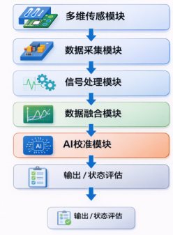
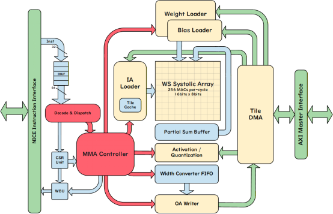
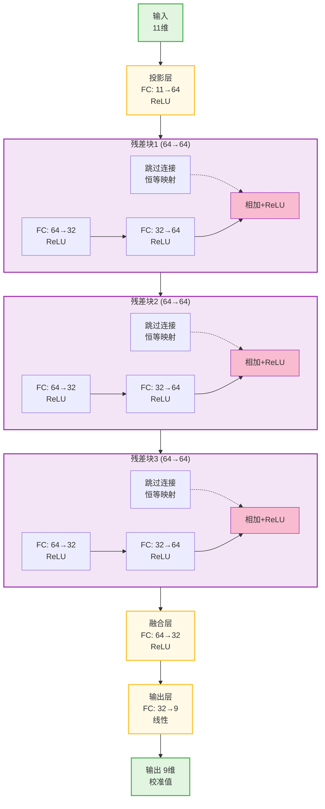

# 微系统内建监测信号融合处理与智能诊断算法研究方案

## 1 项目概述

### 1.1 项目背景

随着微系统在电子装备、精密仪器及复杂工程系统中的广泛应用，其运行环境日趋复杂，系统可靠性问题日益突出。在长期运行过程中，微系统关键参数容易受到温度、湿度、电气负载变化以及器件老化等因素影响，产生参数漂移、性能退化等现象。同时，由于微系统结构高度集成、体积微小，系统内部状态难以通过传统外部检测手段进行实时获取，导致运行状态感知能力不足，故障早期特征难以及时识别。

现有监测方法多依赖单一传感信息或离线检测手段，难以实现对多维物理量的综合监测与分析，也难以支持系统健康状态的实时评估。因此，有必要构建微系统内建监测与智能诊断体系，通过集成多维物理传感器，对温度、湿度、电压、电流等关键参数进行高精度采集，并结合多传感数据融合处理与 AI 智能校准技术，实现对微系统运行状态的实时监测，从而提升系统运行可靠性与可维护性。

### 1.2 项目目标与总体任务

本项目面向微系统运行状态监测与智能诊断需求，通过构建多通道高精度数据采集硬件架构，实现对温度、湿度、电压、电流等多物理量信号的高精度实时采集；研究多传感信号融合滤波与数据处理算法，提高多源传感数据的处理精度与稳定性；开发基于 AI 的智能校准模型，实现传感器误差补偿与数据精度优化；并完成原型系统开发与样机测试验证。最终实现微系统内部多物理传感信号的高精度实时监测与状态智能评估。

## 2 系统总体架构设计

### 2.1 微系统监测与诊断总体架构

微系统监测与智能诊断系统总体架构采用分层设计思想，主要由感知层、数据采集层、数据处理层和智能校准层四个层级组成，各层协同实现多维物理参数监测、数据融合处理及状态评估功能。

1. **感知层**：负责获取微系统运行过程中的关键物理信息，通过集成温度、湿度、电压、电流等多维物理传感器，对系统运行环境与电气参数进行实时感知，为后续数据处理提供基础数据来源。

2. **数据采集层**：负责多通道传感信号的采集与初步处理，主要包括模拟前端电路、高精度模数转换器（ADC）、多通道同步采样机制以及信号调理模块，实现多源传感信号的高精度采集与时间同步。

3. **数据处理层**：作为系统核心算法层，对采集数据进行预处理与融合分析，主要包括数据清洗、异常检测、多传感数据融合以及自适应滤波处理等，以提高多源数据的稳定性与可靠性。

4. **智能校准层**：在数据处理基础上开展智能分析，通过 AI 智能校准模型实现传感器误差补偿与数据精度优化，并结合状态特征分析开展故障诊断与健康评估，实现对微系统运行状态的智能化监测与评估。

### 2.2 系统功能模块划分

系统由多维传感模块、数据采集模块、信号处理模块、数据融合模块及 AI 校准模块构成，各模块通过标准接口实现数据传输，形成完整的微系统监测与诊断处理链路。各模块之间按照"传感获取 — 数据采集 — 信号处理 — 数据融合 — 智能校准"的流程依次连接，形成完整的数据处理链路，并通过统一接口实现模块间的可靠通信与协同工作。

*图 2-1：系统模块划分*

## 3 关键技术研究

### 3.1 多通道高精度大动态范围数据采集硬件架构设计技术

#### 3.1.1 技术目标

本系统围绕多传感器数据处理的精度与效率问题，采用软硬件协同设计方法，结合深度学习回归分析与 FPGA 硬件加速能力，实现对电压、电流、温度、湿度等多维传感信号的高精度、低噪声、大动态范围采集。

#### 3.1.2 硬件架构设计

采集系统基于 Xilinx XC7A200T FPGA 硬件平台搭建，通过 SoPC 的方式集成 AI 推理加速模块、MicroBlaze V 软核处理器以及多种外设接口，构建一个高度集成的智能检测平台。系统同步采集多通道电压、电流、温度、湿度数据，通过神经网络进行融合与校准处理，从而提升测量的精度与稳定性。

系统采用基于 RISC-V 指令集架构的 MicroBlaze V 软核作为主控单元，负责指令调度、外设管理以及数据交互。指令存储器和数据存储器通过本地内存总线与 MicroBlaze 软核直接连接，以确保指令和数据的高速访问。在外围功能模块方面，系统集成 I2C Master 模块用于多传感器数据的同步采集，并连接了 OLED 显示模块用于显示检测结果。UART 通信模块为系统与上位机之间提供数据交互接口。此外还集成按键输入模块作为基础的交互输入来源，以及用于驱动 LED 指示灯的 GPIO 模块。

AI 推理加速模块是系统的核心功能单元，采用兼容 TFLM 的基于脉动阵列的可编程加速器，支持 int8/int16 混合精度计算。加速器集成权值与偏置加载、数据缓冲、脉动阵列计算以及激活函数与量化等功能单元。加速器通过 AXI-Lite Slave 接口接收来自主控处理器的指令与配置信息，通过 AXI4-Full Master 接口与内存系统进行高效的数据读写交互。加速模块架构如图。

AI推理加速模块架构图
#### 3.1.3 关键技术

**1) 大动态范围信号调理**

大动态范围信号调理技术主要面向电压、电流等幅值变化范围较大的信号采集需求。微系统在不同运行工况下，其电气参数可能存在较大的量级变化，如果直接进行固定范围采样，容易出现小信号分辨率不足或大信号饱和失真的问题，从而影响测量精度。在实现上，可采用可编程增益放大器（PGA）对输入信号进行分档放大或衰减，使不同幅值范围内的信号均能匹配后续采集电路的输入范围。对于变化范围更大的测量对象，可结合自动量程切换机制，根据输入信号幅值自动选择合适的测量通道或增益档位，从而兼顾小信号测量精度与大信号测量范围。通过大动态范围信号调理，可提高系统对复杂工况下多类电气参数的适应能力，保证采集结果的线性度与有效性。

**2) 低噪声设计**

低噪声设计是保证高精度数据采集性能的重要基础。微弱传感信号在采集过程中容易受到前端电路噪声、电源纹波、通道串扰以及外部电磁干扰的影响，导致测量结果波动增大、分辨率下降，甚至影响后续算法处理效果。在具体实现上，首先可通过模拟前端优化降低输入级噪声，包括合理设计信号链路、优化输入阻抗匹配、减小无效耦合路径，并控制前端放大与滤波环节的噪声引入。其次，在板级实现中采用 PCB 抗干扰设计方法，通过模拟与数字电路分区布置、关键走线隔离、地线与参考地优化等方式，减小串扰与外界干扰影响。此外，还需采用电源滤波设计对供电噪声进行抑制，通过电源去耦、分级滤波及稳压处理，保证模拟采集链路的供电稳定性。通过上述设计措施，可有效降低系统噪声水平，提高采集精度与运行稳定性。

### 3.2 多传感信号数据融合滤波与处理技术

针对微系统内嵌多维物理传感器输出信号存在的噪声干扰、测量误差等问题，开展多传感信号数据融合与滤波处理技术研究，通过构建统一的数据融合模型，实现多源传感数据的高精度估计与稳定输出。

#### 3.2.1 多传感数据融合算法

在多维传感数据融合过程中，采用数据级融合策略，直接对不同传感器输出的原始测量数据进行统一建模与融合处理。针对温度、湿度、电压、电流等多源信号特性，建立微系统状态空间模型，将系统真实状态作为隐变量，将各传感器测量值作为观测量，构建多变量融合估计模型。

**1) 状态向量定义**

构建系统状态向量为：

$$\mathbf{x} = [T,\ \dot{T},\ H,\ P]^T$$

其中 $T$ 为温度，$\dot{T}$ 为温度变化率（匀速升温模型），$H$ 为湿度，$P$ 为气压。

**2) 状态转移模型**

温度采用匀速变化模型，湿度与气压采用一维随机游走模型。各状态变量的转移方程为：

$$T_k = T_{k-1} + \dot{T}_{k-1}\Delta t + w_T$$

$$\dot{T}_k = \dot{T}_{k-1} + w_{\dot{T}}$$

$$H_k = H_{k-1} + w_H$$

$$P_k = P_{k-1} + w_P$$

状态方程可写成矩阵形式 $\mathbf{x}_{k+1} = \mathbf{F}\mathbf{x}_k + \mathbf{w}_k$，其中状态转移矩阵为：

$$\mathbf{F} = \begin{bmatrix} 1 & \Delta t & 0 & 0 \\ 0 & 1 & 0 & 0 \\ 0 & 0 & 1 & 0 \\ 0 & 0 & 0 & 1 \end{bmatrix}$$

**3) 观测模型**

多传感器观测向量为 $\mathbf{z} = [T_1,\ T_2,\ H,\ P]^T$，观测方程为 $\mathbf{z}_k = \mathbf{H}\mathbf{x}_k + \mathbf{v}_k$，其中观测矩阵为：

$$\mathbf{H} = \begin{bmatrix} 1 & 0 & 0 & 0 \\ 1 & 0 & 0 & 0 \\ 0 & 0 & 1 & 0 \\ 0 & 0 & 0 & 1 \end{bmatrix}$$

基于上述模型，引入 Kalman 滤波算法对系统状态进行递推估计，通过预测与更新两个阶段实现对多源数据的动态融合。

**预测阶段** — 基于系统状态转移模型，对当前时刻系统状态进行预测：

$$\hat{\mathbf{x}}_{k|k-1} = \mathbf{F}\hat{\mathbf{x}}_{k-1|k-1}$$

$$\mathbf{P}_{k|k-1} = \mathbf{F}\mathbf{P}_{k-1|k-1}\mathbf{F}^T + \mathbf{Q}$$

**更新阶段** — 结合各传感器观测数据，对预测结果进行校正：

$$\mathbf{K}_k = \mathbf{P}_{k|k-1}\mathbf{H}^T\left(\mathbf{H}\mathbf{P}_{k|k-1}\mathbf{H}^T + \mathbf{R}\right)^{-1}$$

$$\hat{\mathbf{x}}_{k|k} = \hat{\mathbf{x}}_{k|k-1} + \mathbf{K}_k\left(\mathbf{z}_k - \mathbf{H}\hat{\mathbf{x}}_{k|k-1}\right)$$

$$\mathbf{P}_{k|k} = \left(\mathbf{I} - \mathbf{K}_k\mathbf{H}\right)\mathbf{P}_{k|k-1}$$

通过不断迭代，实现对系统状态的最优估计，在抑制随机噪声的同时，提高多源数据的一致性与融合精度。该方法能够有效融合不同来源、不同精度及不同噪声特性的传感数据，提高系统对复杂工况下多物理量变化的表征能力。

#### 3.2.2 算法实现方案

在完成多传感数据融合模型设计的基础上，采用 C 语言对 Kalman 滤波算法进行实现，并部署于设计的 RISC-V 处理器平台上运行。算法程序按照预测与更新流程进行模块化设计，实现状态估计、协方差更新及增益计算等功能。

针对 RISC-V 平台资源约束，对算法中的矩阵运算与数据处理流程进行优化，提高计算效率与实时性。同时，完成算法程序在目标处理器上的移植与调试，实现多传感数据的实时融合处理。

通过构建测试环境，对算法在 RISC-V 平台上的运行效果进行验证，确保其在精度、稳定性及实时性方面满足系统应用需求。

### 3.3 AI 智能校准技术

传感器在实际工作环境中受温度、湿度、电气负载等多因素影响，存在系统误差与非线性特性。传统单参数校准方法难以应对多维参数耦合情况。本研究采用深度学习方法，**建立多输入多输出非线性神经网络模型，学习11维输入（4路电压、4路电流、2路温度、1路湿度）与9维输出（校准后的电压、电流、湿度）之间的复杂映射关系，实现对传感器误差的自适应补偿**。

**核心功能**：

（1）**非线性误差补偿**——通过神经网络学习传感器的非线性特性，补偿温度、负载等环境因素引起的测量误差，实现对复杂工作环境的自适应校准。

（2）**多参数耦合处理**——处理多维物理参数间的非独立性，充分利用各参数之间的相关性信息，提高复杂工况下的校准精度。

**预期效果**：

经 AI 校准后的数据精度达到表 1 中的指标要求，包括电压 ±10 mV（4通道）、电流 ±10 mA（4通道）、温度 ±1 ℃（2通道）、湿度 ±1%RH（1通道）。

#### 3.3.1 网络架构设计

针对多参数非线性校准问题，采用**残差神经网络**（Residual Network）架构：

**网络拓扑图**：

**网络结构**：

采用**瓶颈残差块**（Bottleneck Residual Block）架构，前向路径为 FC 64→32→64 的多层级结构，配合恒等映射的跳过连接实现深层网络的有效训练。输入层接收 11 维数据，通过投影层（11→64，ReLU）进行初始特征提取与升维。随后经过 3 个瓶颈残差块，每个残差块包含中间层降维（64→32）以减少计算量，然后升维恢复（32→64），并通过跳过连接做加法融合后再进行 ReLU 激活。这种结构既能保证深层网络的训练稳定性，又能有效降低参数量。最后通过融合层（64→16，ReLU）进行特征压缩，输出层（16→9，线性）生成 9 维校准值。

**参数规模与量化策略**：

模型包含约 7,200 个参数，权重大小约 7 KB。采用权重 int8 非对称量化和激活 int16 对称量化的混合精度策略，充分满足嵌入式推理的精度要求和存储约束。

#### 3.3.2 模型训练

使用 TensorFlow/Keras 框架进行模型训练。训练数据包含超过 15,000 个标注样本，覆盖 11 维参数空间，参数范围包括电压 0-40V、电流 0-10A、温度 −40~125°C、湿度 0-100%RH。采用 Adam 优化器，配置 MSE 损失函数和 L2 正则化，预期模型推理误差控制在 1% 以内。

#### 3.3.3 部署方案

量化模型通过 TensorFlow Lite 转换，部署在 RISC-V 定点运算单元上，搭配专用神经网络加速器（DSA）实现高效推理。采用权重 int8 + 激活 int16 的混合精度格式，减少内存占用和计算量。异构 RISC-V + DSA 组合架构充分利用硬件加速能力，实现实时校准需求。

## 4 样机系统设计与实现

### 4.1 原型系统架构

为实现对传感器在不同温湿度组合条件下的响应数据进行批量采集，并构建多样化的数据集，设计并实现了一套数据采集平台。平台采用可控温湿度试验箱和高精度电源对测试环境进行严格控制，确保温度、湿度、电压、电流等参数在规定范围内精确变化。平台的控制装置使用 Xilinx XC7A35T FPGA 开发板，在 MicroBlaze V SoPC 平台上集成了数据采集与存储、以及通信传输功能。

数据采集平台以高精度设备作为参考基准：电压电流采用六位半数字万用表作为采集参考标准，温湿度采用 HDC3020 高精度温湿度参考传感器，其典型湿度测量精度为 ±0.5%RH，温度测量精度为 ±0.1℃，满足技术指标需求。

为实现对电压、电流、温度、湿度数据的多通道多维度采集，设计了数据采集 PCB 电路板。在电压电流采样方面，采用 20 位高精度 ADC 模块进行多通道同步采集，通过精密电阻网络进行信号调理与分压，实现对四通道电压的采集以及四通道电流的精准测量。在温湿度采感方面，使用 I2C 接口与 HDC3020 等多个温湿度传感器进行数据交互，通过多传感器融合算法进行温湿度融合计算，提高环境参数的测量稳定性。基于设计的数据采集 PCB，搭建了完整的采集平台系统。该系统同步采集来自硬件传感器的原始输出与参考基准设备的采集数据，进行逐点对比分析，收集校准数据用于 AI 推理校准模型训练。

### 4.2 软件系统架构

软件系统采用分层架构设计，包括数据采集层、数据处理层、算法层和应用层，各层通过规范接口实现模块间的通信与协作。

**1) 数据采集层**

负责与外部硬件传感器交互，实现多通道、多源数据的实时采集。该层通过 I2C Master 接口驱动温湿度传感器（HDC3020 等），通过 ADC 控制模块进行电压、电流的多通道同步采集。数据采集层对原始数据进行格式转换、时间戳标记和缓存管理，确保数据的完整性与可追溯性，为上层数据处理提供可靠的数据源。

**2) 数据处理层**

实现多传感信号的预处理与融合计算。该层包括数据清洗（异常值剔除、丢失数据填补）、多传感器时间同步、Kalman 滤波融合算法的执行等功能。通过调用由 C 语言实现的融合算法库，对采集的 4 路电压、4 路电流、2 路温度、1 路湿度数据进行状态估计与协方差更新，输出融合后的 11 维中间数据，为后续 AI 校准提供高质量的输入。

**3) 算法层**

部署经量化后的 AI 校准神经网络模型，调用专用 DSA 加速器实现高效推理。该层接收来自数据处理层的 11 维输入数据，通过 AXI-Lite Slave 接口向加速器下发推理指令与模型参数，通过 AXI4-Full Master 接口读取加速器的推理结果，最终输出 9 维校准值（4 路校准电压、4 路校准电流、1 路校准湿度）。该层支持模型的动态加载与切换，便于后续模型迭代与优化。

**4) 应用层**

实现系统与用户的交互界面，包括 UART 上位机通信、OLED 本地显示和按键控制等功能。应用层接收来自算法层的校准结果，进行数据格式化、可视化展示；同时响应用户命令，支持系统工作模式切换、参数查询、数据导出等操作。应用层还负责与上位机实时通信，上传采集与校准数据用于离线分析与模型训练。

各层通过统一的数据接口与函数调用规范实现耦合，确保系统模块的独立可测试性与扩展性。

## 5 测试验证

### 5.1 测试内容

通过引入高精度参考设备，对系统输出结果进行对比分析。

在**电气参数验证**方面，采用五位半数字电压电流表作为参考标准，对系统测得的电压、电流数据进行同步测量与对比，评估采集与处理结果的准确性。

在**环境参数验证**方面，采用高精度温湿度传感器作为参考标准，对系统输出的温度、湿度数据进行对比分析，验证环境参数测量精度。

通过参考测量值与系统输出值之间的偏差分析，实现对系统整体测量精度的定量评估。

### 5.2 技术指标

**1) 多通道数据采集能力指标**

**表 1：数据采集指标要求**

| 序号 | 指标 | 代号 | 单位 | 通道数 | 最小值 | 最大值 | 分辨率 | 误差 |
|:----:|:----:|:----:|:----:|:------:|:------:|:------:|:------:|:----:|
| 1 | 电压 | V | V | 4 | 0 | 40 | 1 mV | ±10 mV |
| 2 | 电流 | I | A | 4 | 0 | 10 | 1 mA | ±10 mA |
| 3 | 温度 | T | ℃ | 2 | −40 | 125 | 0.1 ℃ | ±1 ℃ |
| 4 | 湿度 | H | ppm | 1 | 0 | 4800 | 1 ppm | ±1%RH |

**2) 智能校准要求**：经 AI 校准后的数据准确性提升不低于 20%。

**3) 系统架构**：开发轻量化、可编程的 RISC-V + DSA 架构，运算性能达到 1 GOPS。

**4) 硬件设计**：针对传感信号开展微弱信号调理电路拓扑及硬件架构设计。

## 6 项目实施计划

本项目以合同正式签订之日为 T0，按照"系统设计 — 算法开发 — 系统集成 — 样机验证"的技术路线分阶段实施：

**第一阶段（T0 + 2 月内）**：开展系统总体架构设计，完成功能模块划分及技术路线设计，开展多通道数据采集硬件基础开发，完成方案评审。

**第二阶段（T0 + 4 月内）**：开展多传感数据处理与融合算法研究，完成多源数据预处理、融合滤波等算法程序开发，完成算法程序样机验证。

**第三阶段（T0 + 8 月内）**：开展 AI 智能校准模型及相关算法研究，完成模型构建、算法开发及数据样机验证。

**第四阶段（T0 + 10 月内）**：完成系统整体集成与样机测试验证，形成相关测试结果与技术报告，交付多通道数据采集分析原理验证板。

项目需在 2026 年 12 月 30 日前按合同要求完成项目验收及相关评审工作。

## 7 项目成果

项目完成后形成以下主要成果：

**（1）多通道数据采集分析原理验证板**：实现多维物理传感信号采集与分析功能的完整验证，包括硬件电路设计、信号调理和数据采集等模块。

**（2）多传感数据处理与融合算法程序**：实现多源传感数据的预处理、融合计算及信号处理等核心算法，支持 RISC-V 平台上的实时执行。

**（3）AI 智能校准模型及算法程序**：实现基于神经网络的传感器误差补偿与智能校准功能，提供量化模型和部署代码。

**（4）项目交付软件程序及相关文档电子介质**：包括完整的源代码、设计文档、测试报告和用户手册等。
